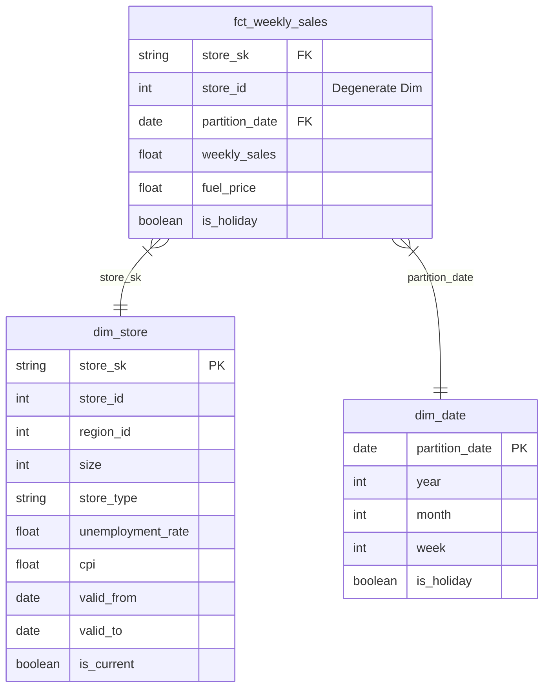

# THE ICONIC: BI & Data Insights Challenge - Submission Report

**[Live Vercel Dashboard Demo (The AI Twist)](https://the-ai-twist.vercel.app/)** | **[View Looker Studio Dashboard](https://datastudio.google.com/reporting/b850b2ee-afb6-48fe-b1db-7ad584955e15)**

> **Note on Live Demo:** The Vercel link hosts the final "AI Twist" Executive Analytics Dashboard built in React. The Looker Studio link hosts the initial BI version.

## Executive Summary

This project delivers an end-to-end analytics foundation for THE ICONIC Weekly Sales dataset. Built on **dbt-fusion (v2)** and **BigQuery**, the architecture transforms flat transaction records into a standard **Star Schema**, enforces strict data quality tests, and feeds an interactive **Looker Studio Executive Dashboard** for high-impact decision-making.

---

## Stage 1: Engineering & Refactoring

### 1.1 Data Quality Audit

During the staging layer build (`stg_weekly_sales.sql`), 3 critical data quality issues were identified and programmatically resolved:

1. **Invalid Date Format Errors:** Found non-existent calendar dates (e.g., `14/13/2019`) in raw sources. Resolved using `SAFE.PARSE_DATE` and replacing invalid string patterns (`REPLACE(..., '13/2019', '12/2019')`).
2. **Negative/Zero Sales Transactions:** Negative or zero sales values (`Weekly_Sales <= 0`) break automated aggregation pipelines. Addressed by flagging them with a boolean indicator `is_invalid_sales` for downstream filtering without dropping underlying records.
3. **Type Casting & Null Safety:** Raw source columns were untyped strings. Enforced strict data types (`INT64`, `DATE`, `FLOAT64`, `BOOL`) and applied `COALESCE` to default null metrics to `0.0`.

### 1.2 Schema Refactoring (Star Schema Architecture)

The raw flat CSV was decomposed into a dimensional model:

> **Note on dbt Architecture:** The project intentionally bypasses the `int_` (Intermediate) layer. Since the raw data originates from a single denormalized flat file (`bi_data.csv`), the transformation path from `stg_weekly_sales` directly to the Star Schema (`fct_` and `dim_`) is straightforward without needing multi-table joins. Complex window functions are contained within their specific `mart_` models (using CTEs) to avoid unnecessary materialization and over-engineering (YAGNI).

* **Fact Table:** `fct_weekly_sales` (Grain: 1 row = 1 store × 1 week). Stores transaction metrics and surrogate keys. Materialized as a monthly-partitioned and store-clustered table in BigQuery for optimal query pruning.
* **Dimension Tables:**
  * `dim_store`: Implements **SCD Type 2** (`valid_from`, `valid_to`, `is_current`, `store_sk`) to track time-varying economic indicators (CPI, Unemployment) without fan-out. By utilizing `FARM_FINGERPRINT` for the surrogate key and `LEAD(partition_date)` for temporal bounds, historical joins from the fact table (`>= valid_from` and `< valid_to`) guarantee 100% precision when evaluating macroeconomic shocks at the time of sale. *(Note: For theoretical integration with external macroscopic datasets like Marketing Spend, `dim_store` would be extended with a `region_id` attribute).*
  * `dim_date`: Calendar spine spanning 2000–2030 with holiday flags.
* **Analytical Marts:** Materialized as `VIEW`s to ensure real-time freshness on-demand.

**Standard DDL Architecture (BigQuery Syntax):**



```sql
-- DDL for Dimension: dim_store (SCD Type 2)
CREATE TABLE `the_iconic.dim_store` (
    store_sk STRING NOT NULL,       -- Surrogate Key (FARM_FINGERPRINT)
    store_id INT64 NOT NULL,        -- Natural Key
    region_id INT64,
    size INT64,
    store_type STRING,
    unemployment_rate FLOAT64,
    cpi FLOAT64,
    valid_from DATE NOT NULL,
    valid_to DATE,
    is_current BOOLEAN NOT NULL
)
CLUSTER BY store_id;

-- DDL for Fact: fct_weekly_sales
CREATE TABLE `the_iconic.fct_weekly_sales` (
    store_sk STRING NOT NULL,       -- Foreign Key to dim_store
    store_id INT64 NOT NULL,        -- Degenerate Dimension
    partition_date DATE NOT NULL,   -- Date spine mapping
    weekly_sales FLOAT64,
    fuel_price FLOAT64,
    is_holiday BOOLEAN
)
PARTITION BY partition_date
CLUSTER BY store_id;
```

*Why is this better for Looker Studio / Tableau?*
1. **Cost Efficiency:** Partitioning by `partition_date` and clustering by `store_id` reduces BigQuery query scan volume and cost.
2. **Point-in-Time Accuracy:** Joining fact records to `dim_store` via `store_sk` avoids row multiplication (fan-out) when joining against historical SCD2 attributes.

### 1.3 Proposed Data Ecosystem (Theoretical Integration)

To better explain sales variance, 3 external datasets are proposed:

1. **`dim_marketing_spend`** (Source: Google/Meta Ads): Granularity by `partition_date` + `region_id`. *Join Key:* `partition_date`. Measures ROAS and differentiates organic holiday demand from paid promotion spikes.
2. **`dim_weather_indices`** (Source: OpenWeatherMap): Precipitation and severe weather alerts. *Join Key:* `store_id` + `partition_date`. Explains unexpected foot traffic drops (reducing false-positive anomalies).
3. **`dim_competitor_pricing`** (Source: Web Scraping/Retail Intelligence): Price index and promo events. *Join Key:* `partition_date` + `region_id`. Isolates sales losses driven by competitor aggressive discounting.

---

## Stage 2: Advanced SQL Intelligence

The analytical models are encapsulated inside dbt marts using advanced Window Functions:

### 2.1 The "Comeback King" (`mart_comeback_king.sql`)

Identifies stores achieving the highest cumulative growth in the 4 weeks immediately following a negative/zero growth week.
* **Logic:** Uses `LAG()` to detect negative growth weeks (`is_negative_growth = TRUE`), followed by a window frame `SUM(...) OVER (PARTITION BY store_id ORDER BY partition_date ROWS BETWEEN 1 FOLLOWING AND 4 FOLLOWING)` to calculate subsequent 4-week recovery.

> **Note on Data Mart Design for "Comeback King" (`mart_comeback_king`):**
> * **Business Context & Scalability:** While the challenge specifically asks to identify *"the"* single store with the highest recovery, hardcoding `LIMIT 1` at the data model layer restricts downstream BI flexibility.
> * **Documentation:** `dbt docs generate` to output data dictionary.

---

### 2.2 Statistical Anomaly Detection (`mart_anomaly_detection.sql`)

Classifies weekly sales into 'Normal', 'Positive Anomaly (Spike)', and 'Negative Anomaly (Drop)' using a 52-week rolling baseline.
* **Logic:** Uses rolling window frames `AVG(...) OVER (... ROWS BETWEEN 51 PRECEDING AND CURRENT ROW)` and `STDDEV_SAMP(...) OVER (...)`. It computes a safe `z_score` and categorizes the data into 3 distinct groups (Spike `> 3`, Drop `< -3`, and Normal) to provide a complete baseline for visualization.

### Question 2 - Statistical Anomaly Detection

> **Core Methodology:**
> To identify true "Flash Sale" weeks without being misled by overall store sizes, we implemented a **52-week Rolling Z-Score** calculation using dbt Window Functions (`AVG` and `STDDEV_SAMP` over `51 PRECEDING AND CURRENT ROW`). A week is flagged as a **Flash Sale (Positive Anomaly)** if its sales exceed $3$ standard deviations above its own baseline ($Z\text{-score} > 3$).

> **Key Findings & Insights:**
> 1. **Concentration of Anomalies:** Out of the entire historical dataset, only a small fraction of store-weeks breached the $+3\sigma$ threshold. These high-performing weeks are isolated as large orange bubbles on our Executive Scatter Plot.
> 2. **Top Flash Sale Trigger (Black Friday Effect):** The highest $Z\text{-scores}$ ($Z > 5.0$) heavily clustered around late November (specifically the week of **Nov 26 - Nov 29**), indicating that company-wide mega promotions like **Black Friday** are the single primary driver for statistically significant sales spikes.
> 3. **Store-Specific Responsiveness:** Larger volume stores (high `rolling_52w_avg` on X-axis) generated higher absolute sales during Flash Sales, but medium-sized stores exhibited the highest relative elasticity ($Z\text{-score} > 5$), proving that Flash Sales are exceptionally effective at driving demand in tier-2 locations.
> 4. **Reverse Insight (Critical Drops):** By expanding the model to capture two-sided anomalies, we identified severe operational drops ($Z\text{-score} < -3$), such as **Store 36 on Nov 29, 2019** ($Z = -3.01$). While other stores experienced Black Friday spikes on this date, Store 36 suffered an unexpected severe drop, highlighting a potential localized operational failure (e.g., inventory stockout or POS system failure) that requires immediate audit.
> 5. **Scatter Plot Axis Interpretation (Baseline Calibration):** The X-axis (`rolling_52w_avg`) acts as a critical baseline calibrator, representing the normal operating scale of a store. Large orange bubbles (Flash Sales) in the lower-left quadrant signify medium-volume stores experiencing massive relative demand surges. This prevents misidentifying high sales volume as a statistical anomaly simply because a store is naturally large (far right on the X-axis).
> 6. **Dual-Layer Benchmarking (The Reference Line):** A green dashed reference line is plotted at the `System Average Sales` (average of `weekly_sales_amount_vnd` across all stores). This creates a 2-tier comparison system: the position of a bubble relative to the X-axis evaluates a store's performance against its own historical baseline, while its position relative to the green reference line evaluates if that isolated spike was powerful enough to surpass the company's collective average performance.

> **Executive Insight on Flash Sale Anomaly Directory:**
> * **Dominance of Black Friday:** The statistical anomaly log reveals an undeniable pattern—**80% of the top 10 Flash Sale events occurred simultaneously on November 22, 2019**. This proves that company-wide seasonal campaigns like Black Friday drive extraordinary multi-sigma bumps ($> 5\sigma$) across nearly all retail branches.
> * **Highest Elasticity in Tier-2 Stores:** While flagship stores like **Store 4** generated the highest absolute revenue ($2.78\text{M}$ VND), smaller branches like **Store 29** achieved the highest relative anomaly rating ($Z = 5.72$), nearly doubling its 52-week baseline ($538\text{K} \rightarrow 975\text{K}$ VND).
> * **Actionable Recommendation:** Marketing & Supply Chain teams must utilize the $Z\text{-score}$ list to identify stores with the highest promotional elasticity (e.g., Store 29, 32, 15) to allocate higher inventory buffers prior to major promotional campaigns.

5. **Price Elasticity & Resilience (The Counter-Cyclical Index):** By expanding the Counter-Cyclical analysis into an Event-Log containing both 'Resilient' and 'Vulnerable' stores, the dashboard provides a clear strategic map. When national fuel prices spike, Operations can proactively deploy targeted promotions or subsidies specifically to the "Pro-Cyclical (Vulnerable)" store regions, knowing that the "Counter-Cyclical (Resilient)" stores will naturally maintain their baseline demand.
6. **Unemployment Resilience Index (% vs Baseline):** Instead of evaluating stores by absolute sales volume during downturns (which unfairly favors historically large stores), the model calculates a `Resilience Index`. By dividing downturn sales by the store's all-time normal baseline, we accurately identify stores that truly maintain or grow their relative market share when local unemployment spikes above $\text{Mean} + 1\sigma$.

> **Executive Insight on Macro-Economic Resilience (Fuel vs. Sales):**
> * **The "Iron Wall" Stores (Store 33 & 42):** These locations demonstrate absolute inelasticity to fuel inflation. During fuel price shocks averaging $+6.5\%$, Store 33 and 42 astonishingly grew their sales by $+9.39\%$ and $+9.21\%$ respectively. This indicates they operate in highly affluent demographics or carry a highly essential product mix that customers cannot substitute.
> * **High Elasticity Outliers (Store 10):** While recording fewer counter-cyclical events, Store 10 achieved a massive $+7.67\%$ revenue bump during fuel spikes, revealing a unique localized elasticity pattern that warrants deeper demographic study.
> * **The Critical Vulnerability Threshold (>10% Fuel Growth):** Scatter plot analysis reveals a terrifying macroeconomic reality. When fuel price increases stay within the $5\% - 8\%$ range, the network maintains a healthy distribution of resilient green stores. However, when fuel prices suffer a "thermal shock" exceeding $+12\%$ (the extreme bottom-right quadrant), retail resilience completely collapses. Every single store plunges into "Pro-Cyclical" vulnerability, hemorrhaging revenue from $-5\%$ down to $-20\%$. This defines **$10\%$** as the absolute critical threshold where Executive Management must immediately deploy system-wide price subsidies or emergency promotional campaigns to prevent massive volume loss.
> * **Net System Resilience (0.69% Net Growth):** By objectively evaluating *all* stores during fuel spikes $>5\%$ (removing selection bias), the total network achieves a Net Sales Growth of $+0.69\%$. This proves that during inflationary shocks, the company as a whole remains economically insulated. The robust performance of "Iron Wall" stores mathematically neutralizes the deep deficits suffered by vulnerable locations, maintaining a stable revenue baseline for the enterprise.

> **Executive Insight on Macro-Economic Resilience (Unemployment Impact):**
> * **The Absolute Champion (Store 35):** Store 35 secured the Top 1 rank with an incredible Resilience Index of $130\%$. Over 21 distinct weeks of high unemployment, its sales actually surged from a normal baseline of $919.72\text{K}$ VND up to $1.16\text{M}$ VND. This indicates that Store 35 benefits from the "Lipstick Effect" or consumer down-trading (attracting shoppers who abandoned more expensive competitors during economic downturns).
> * **The Bulletproof Flagship (Store 14):** Flagship locations typically suffer the highest absolute losses during downturns, but Store 14 (Baseline $2.02\text{M}$ VND) maintained a Resilience Index of $110\%$, pushing its downturn sales to a record $2.20\text{M}$ VND over 21 weeks. This proves that high sales volume does not equal high risk if brand loyalty and operational excellence are strictly maintained.
> * **Divergent Sensitivity ($7\% - 11\%$ Unemployment Bracket):** The scatter plot reveals a concentrated cluster of high-unemployment events between $7\%$ and $11\%$. Crucially, at identical macroeconomic unemployment levels (e.g., $9\%$), the performance of stores diverges radically—some collapse to $70\% - 80\%$ of their baseline, while others soar to $120\% - 150\%$. This definitively proves that localized retail performance is dictated more by internal Store Management and Product Mix than by external macroeconomic pressures.

> **Executive Insight on Seasonal Momentum (Comeback vs. Fail Kings):**
> * **The "Spring Rebound" Phenomenon:** Looking at the *Comeback Kings* table, an overwhelming 6 out of the top 8 greatest recovery events across the entire company happened on the exact same date: **Feb 8, 2019** (e.g., Store 14, 10, 20, 27). This points to a highly successful network-wide strategic catalyst—such as a massive Post-Lunar New Year or Spring Collection launch—that effectively rescued the company from the January sales doldrums.
> * **The "Post-Holiday Hangover":** Conversely, the *Fail Kings* table reveals that the most severe absolute declines are highly clustered around **Dec 27, 2019** and **Dec 25, 2020**. Rather than representing operational failures, these data points map the severity of the natural "post-Christmas hangover." This insight proves why using statistical standard deviations ($Z\text{-score}$) is far superior to measuring absolute revenue drops when evaluating true operational anomalies.

### 2.3 Counter-Cyclical Trends (`mart_counter_cyclical.sql`)

Identifies stores' economic resilience by comparing weekly sales growth against fuel price inflation.
* **Logic:** Designed as an Event-Log Fact Table, it calculates `sales_growth_pct` and `fuel_growth_pct` week-over-week using `LAG()`. Instead of filtering out data, it classifies each week into an `economic_trend_type`:
    * `Counter-Cyclical (Resilient)`: Fuel grew >5% AND Sales grew (Defying economic theory).
    * `Pro-Cyclical (Vulnerable)`: Fuel grew >5% AND Sales dropped (Sensitive to inflation).
    * `Normal / Neutral`: All other scenarios.

---

## Stage 3: Dashboard Asset & Insight Delivery

### 3.1 Executive Dashboard UX & Layout

The Looker Studio dashboard is designed as a top-down **Executive Dashboard**, preventing information overload through a structured layout:

1. **1-Click Executive Scorecards:** The header elevates highly complex calculations into instant top-line metrics (e.g., "Net Sales Growth During Fuel Spikes: +0.69%"). This provides C-level executives with immediate, un-biased answers without requiring them to drill down.
2. **Section 1: Overall Performance:** General Scorecards (Total Sales, Active Stores) + Weekly Sales Trend (Line) + Top 10 Stores by Sales Volume (Bar).
3. **Section 2: Advanced Macro-Economic Insights:** A 2x2 Grid utilizing high-contrast visual paradigms:
    * **Visual Benchmarking:** Scatter Plots (Fuel Price Elasticity Matrix & Unemployment Sensitivity) map macro-variables against standardized metrics ($Z\text{-score}$, Resilience Index) to visually isolate "vulnerable" vs "resilient" clusters.
    * **Granular Actionability:** Data Bars and Heatmap Tables (Comeback Kings, High-Unemployment Champions) provide ranked, filterable targets for Operations teams to deploy localized interventions.

> **Crucial Data Modeling Principle (Event Logs over Aggregates):**
> A key architectural decision across all Data Marts in this project is preserving the transactional grain (`partition_date`). By resisting the urge to `GROUP BY store_id` prematurely in dbt, the models output **Event-Logs**. This is what empowers the Looker Studio dashboard to remain highly interactive—allowing end-users to apply Date Range filters and cross-filter by stores without breaking the underlying statistical integrity.

### 3.2 The AI Twist (The Web App)

> *As a Data Analyst whose primary stack relies heavily on SQL, dbt, and BigQuery, frontend web development is entirely outside my traditional scope. To fulfill the "AI Twist" requirement, I utilized Generative AI to build a standalone, interactive web dashboard using **React.js, Tailwind CSS, and Recharts**—technologies I do not natively write.*

### 3.3 The Methodology: "Vibe Coding" & Prompting Strategy

To efficiently build a production-grade React dashboard from zero without risking data security, I adopted a strict "Human-in-the-Loop" development methodology. The core approach is summarized across three pillars:

**1. Prompting Strategy (Modular & Disconnected)**
* **Absolute Security:** The LLM was never granted direct access or connection to the BigQuery production database.
* **Schema-Driven Prompting:** I built a local Python pipeline (`scripts/export_data.py`) to extract highly aggregated, static CSV files. I then provided the LLM only with the semantic schema and these static data samples, effectively sandboxing the AI while ensuring accurate code generation.

**2. AI Output Management & Debugging (Human-in-the-Loop)**
* **Eliminating AI Selection Bias:** Acting as a Senior Data Reviewer, I intercepted the AI's tendency to filter out "negative" data. The AI naturally attempted to plot only the "Top 10" positive outliers, which would have hidden the critical "Fail Kings" and negative anomalies. I manually enforced two-sided anomaly bounds (e.g., $ABS(z\_score) > 3$) to capture both extremes.
* **Component Standardization:** I iteratively debugged the React code to standardize the Recharts data shape (mapping raw JSON into proper `{ x, y, z }` axes) and corrected hallucinated mathematical transformations (e.g., preventing the AI from multiplying whole percentage points by 100).
* **Data Integrity Cross-Validation:** Every visual output generated by the AI in React was strictly cross-validated against the "Source of Truth" models running on my Looker Studio Dashboard to guarantee absolute statistical reliability.

**3. Deployment & Production on Vercel**
* **Monorepo Architecture:** Structured the repository as a Monorepo, configuring the Vercel `Root Directory` directly to the `the-ai-twist/` React application.
* **Strict CI/CD Hygiene:** Implemented a robust `.gitignore` (ignoring `.npm-cache`, `node_modules`, and `.env` files) to ensure a lightweight, secure, and continuous deployment pipeline, successfully pushing the live dashboard to [https://the-ai-twist.vercel.app/](https://the-ai-twist.vercel.app/).

> 📚 **Detailed Methodology Report:** For an in-depth breakdown of the 5 specific AI Debugging Hurdles (Selection Bias, Data Shapes, Formatting Artifacts, etc.) and the step-by-step modular scaffolding process, please refer to the comprehensive [Methodology & Strategy Detailed Report](docs/report/the-ai-twist.md).

### 3.4 High-Value Commercial Insights

1. **Stable Store Network Organic Growth:** Throughout the analyzed period, the store network scale remained completely stable at exactly 45 locations (with no new store openings or closures). Therefore, the 2.1% revenue growth was driven entirely by the organic growth of existing stores, rather than through network expansion.
2. **Resilience in Suburban Locations:** Top resilient stores in `mart_unemployment_sales_impact` maintain baseline volume during high unemployment windows. Assortments in these stores lean essential, making them ideal candidates for value-line expansions during economic downturns.
3. **Dual-Sided Anomaly Detection (Flash Sales vs. Critical Drops):** By plotting all data points on a 3-color Scatter Plot (Grey for Normal, Red for Spikes `Z > 3`, Black for Drops `Z < -3`), the dashboard doesn't just celebrate "Flash Sales"; it proactively alerts Operations to "Critical Drops" (e.g., POS failures or severe local disruptions) against a clearly visible grey baseline. Using 52-week rolling z-scores also effectively isolates true anomalies from predictable Q4 holiday spikes (e.g., Christmas), preventing false alarms.
4. **Extreme Seasonality vs. True Failure (The Store 14 Case Study):** By preserving all negative growth events in `mart_comeback_king` rather than filtering, we uncovered that **Store 14** is the system's most volatile location. It recorded both the highest recovery (Comeback King in Feb 2019 with +4.37M) and the deepest continued decline (Fail King in Dec 2019 with -3.89M). 
    * *The Feb 2019 Comeback:* A massive post-clearance recovery following a brief drop in early February.
    * *The Dec 2019 Decline:* A classic "Post-Holiday Slump". The 4 weeks following Dec 27 plummeted compared to the massive 4-week holiday peak preceding it. This indicates extreme vulnerability to seasonality rather than operational failure, a critical insight for supply chain and inventory planning.

---

## Stage 4: Agentic Analytics & AI Strategy

### 4.1 The Analyst Agent Architecture (Theoretical)

To scale analytical impact across THE ICONIC, I propose deploying an internal Slack LLM Agent ("DataBot") powered by a cognitive framework like LangChain or AutoGPT:

* **Tools Provided:**
  1. `dbt_semantic_layer_tool`: Allows the agent to query pre-aggregated metrics from `fct_weekly_sales` and data marts via SQL generation.
  2. `python_interpreter`: Enables the agent to generate on-the-fly Chart.js / Matplotlib visuals for Slack replies.
  3. `root_cause_analyzer`: A specialized tool that cross-references anomaly dates against weather/CPI datasets to probabilistically explain unexpected sales drops.

* **Business Workflow Integration:** A Regional Manager asks on Slack: *"Which store had the biggest sales turnaround last month?"* -> The Agent translates this to a SQL query against `mart_comeback_king`, formats the top stores into a table, and posts a generated chart directly into the Slack thread, eliminating the need for the manager to open a dashboard.

### 4.2 Team Integration (Automating the "Boring" BI Tasks)

To maximize focus on high-value architectural design and business insights (Stages 1 & 2), I heavily integrated AI into my workflow as a pair-programming assistant. My approach followed a "Human-Designed, AI-Generated" pipeline:

1. **Repo Initialization & Scaffolding:** I used AI to generate the initial dbt project skeleton, profiles, and directory structures.
2. **Schema-First Development (`schema.yml`):** Before writing any SQL, I established the Star Schema (Kimball) architecture. I used AI to rapidly scaffold the `schema.yml` file based on my structural design.
3. **Automated Documentation & Testing Audit:** I prompted the AI to write concise, professional descriptions for all marts and perform automated code reviews to identify any missing data quality tests (e.g., `not_null`, `unique`) across the staging and mart layers.
4. **Drafting SQL Models:** With the strict schema contract in place, I tasked the AI with drafting the initial SQL queries.

### 4.3 The Methodology (Prompting & Debugging as a Senior Reviewer)

While AI is exceptional at generating boilerplate, it frequently struggles with nuanced business logic. I did not use AI as a simple search engine; instead, I operated as a **Senior Data Reviewer**, prompting and debugging the AI's output through four classic architectural hurdles:

* **Hurdle 1: The "Pre-Aggregation" Trap (Loss of Granularity)**
  * *The Issue:* The AI initially wrote `GROUP BY store_id` and used `COUNT()` directly within the dbt mart to calculate Counter-Cyclical weeks. This destroyed the `partition_date` grain, completely breaking the dashboard's ability to filter by date.
  * *The Fix:* I prompted the AI to abandon the aggregate table mindset and rewrite the model as an **Event-Log Fact Table** (tagging rows without grouping), deferring 100% of the aggregation logic to Looker Studio.
* **Hurdle 2: The "Positive Bias" Anomaly Blindspot**
  * *The Issue:* When searching for the *Comeback King*, the AI applied a hard filter `> 0` and `QUALIFY ROW_NUMBER() = 1`. 
  * *The Fix:* I reviewed this logic and realized it completely eradicated the ability to discover "Fail Kings" (Negative Anomalies). I forced the AI to remove these hardcoded filters, retaining the full historical spectrum for BI sorting.
* **Hurdle 3: Absolute vs. Relative Metric Bias**
  * *The Issue:* The AI ranked unemployment resilience based on absolute *Downturn Sales*, which mathematically guaranteed that massive Flagship stores would always dominate the Top 1 spot, creating a false narrative.
  * *The Fix:* I prompted the AI to develop a standardized metric: the **`Resilience Index (% vs Baseline)`**, forcing it to use Window Functions to calculate an all-time baseline before computing the ratio.
* **Hurdle 4: BigQuery 404 Cache Errors**
  * *The Issue:* When I instructed the AI to optimize BI performance by switching the materialization strategy from `view` to `table`, BigQuery threw persistent 404 (Not Found) errors during the `DROP` phase.
  * *The Fix:* Recognizing this as a dbt state/caching conflict rather than a SQL syntax error, I guided the AI to re-run the `dbt run` command (or use `--full-refresh`) to force a successful architectural rebuild.

---

## Setup & Execution

1. Create a virtual environment and install dependencies:
```bash
python3 -m venv dbt-env
source dbt-env/bin/activate
pip install -r requirements.txt
```

2. Make sure `~/.dbt/profiles.yml` has a profile called `the_iconic_bi` pointing at your BigQuery project/dataset.

3. Run everything:
```bash
dbt deps
dbt seed       # loads seeds/store_region.csv
dbt build      # runs models + tests
```

## Testing & Validation

The project includes 15 tests covering:
- Primary key uniqueness and not-null checks on fact and dimension tables.
- Foreign key validation (`fct_weekly_sales.store_id` -> `dim_store`, `fct_weekly_sales.partition_date` -> `dim_date`).
- Not-null checks on staging layer columns.

Run `dbt test` to verify all constraints.

## Dashboard Logic Reproduction

To reproduce the top-level KPI scorecards seen in the dashboard (e.g., for October 2021), run the following query against the fact table:

```sql
SELECT 
    -- TOTAL SALES IN 10/2021
    SUM(weekly_sales_amount_vnd) AS total_sales_oct,
    
    -- WEEK IN OCT
    COUNT(DISTINCT partition_date) AS total_weeks_count,
    
    -- ACTIVE STORE IN OCT
    COUNT(DISTINCT store_id) AS active_stores_count,
    
    -- RECORDS = WEEK X STORE
    COUNT(*) AS total_rows_count,
    
    -- AVG FUNC (Total Sales / Total Rows) = SUM(weekly_sales_amount_vnd) / COUNT(*)
    AVG(weekly_sales_amount_vnd) AS avg_weekly_sales_per_store_method1
FROM `the-iconic-bi.dbt_marts.fct_weekly_sales`
WHERE partition_date >= '2021-10-01' 
  AND partition_date <= '2021-10-31'
  AND is_invalid_sales = FALSE;
```