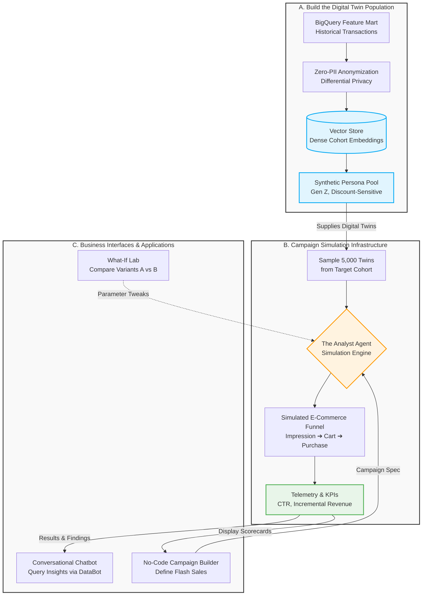

# THE ICONIC: BI & Data Insights Challenge - Submission Report

**[Live Vercel Dashboard Demo (The AI Twist)](https://the-ai-twist.vercel.app/)** | **[View Looker Studio Dashboard](https://datastudio.google.com/reporting/b850b2ee-afb6-48fe-b1db-7ad584955e15)**

> **Note on Live Demo:** The Vercel link hosts the final "AI Twist" Executive Analytics Dashboard built in React. The Looker Studio link hosts the initial BI version.
>
> **Scope disclosure:** the "ICONIC Data Agent" chat panel in the React app is a **UI prototype** (labelled as such in the interface). It returns a scripted response to illustrate the interface for the Stage 4 Analyst Agent and is not connected to an LLM or to BigQuery. Every chart in the app is driven by real exported mart data.

[](https://the-ai-twist.vercel.app/)

**Reproducibility:** every figure quoted in this repository can be recomputed from source with
`scripts/venv/bin/python scripts/verify_insights.py`, which rebuilds the entire pipeline from
`raw/bia_data.csv` in DuckDB — independently of BigQuery. Both engines agree exactly (169
positive anomalies, 10 negative, 12.88 peak sigma).

---

## TL;DR: Project Completion Master Checklist

This repository represents a complete submission for **THE ICONIC: BI & Data Insights Challenge**, executing all 4 Stages.

Below is the detailed alignment between THE ICONIC's requirements and the delivered solutions:

### Stage 1: Engineering & Refactoring

| Requirement | Delivered Solution | Status |
| --- | --- | --- |
| **1. Data Quality Audit** | Identified and resolved 4 source issues in `stg_weekly_sales.sql`:<br><br>1. **Invalid date `14/13/2019`** (store 42). Month 13 does not exist, and a string `REPLACE` to Dec 14th yields a Saturday — the only off-cadence date among 144, which would shift that store's `LAG()` and rolling windows by one position. Recovered as **`2019-06-14`**, confirmed three ways: it is the single gap in store 42's 143-week sequence, its unemployment value occurs only in that store's Mar–Jun 2019 window, and its CPI interpolates exactly between the adjacent weeks. Enforced by a Friday-cadence dbt test, so the next occurrence fails the build rather than being silently mis-mapped.<br><br>2. Flagged zero/negative sales via `sales_quality_code` (VALID / MISSING / NEGATIVE / ZERO) rather than dropping rows.<br><br>3. Enforced `SAFE_CAST` on every column, so one malformed string cannot abort the pipeline.<br><br>4. **An inverted source flag:** `Is_holiday_week` marks the week *after* Christmas (0.86× an average week) and misses the week *before* it (1.72× — the largest trading week in the data). It passes every schema test, which is why it needed finding by hand. Corrected via `dim_date.is_trading_peak_week`. | **DONE** |
| **2. Schema Refactoring & DDL** | Designed a standard Kimball **Star Schema** (`fct_weekly_sales`, `dim_store`, `dim_date`).<br><br>• `dim_store` implements **SCD Type 2** (`valid_from`, `valid_to`, `is_current`, `store_sk`).<br><br>• Provided **BigQuery DDL** featuring `PARTITION BY partition_date` and `CLUSTER BY store_id`.<br><br>• Explained the benefits of preventing fan-out and optimizing scan costs for BI tools. | **DONE** |
| **3. Proposed Data Ecosystem** | Proposed 3 external tables, explicitly defining Granularity and Join Keys to prevent **Cartesian Fan-out** data multiplication bugs:<br><br>1. `dim_marketing_spend` (Key: `partition_date` + `region_id` via `dim_store`).<br><br>2. `dim_weather_indices` (Key: `store_id` + `partition_date`).<br><br>3. `dim_competitor_pricing` (Key: `partition_date` + `region_id` via `dim_store`). | **DONE** |

### Stage 2: Advanced SQL Intelligence

| Requirement | Delivered Solution | Status |
| --- | --- | --- |
| **1. The "Comeback King"** | Authored `mart_comeback_king.sql` using `LAG()` to detect negative growth weeks, combined with a `SUM(...) OVER (PARTITION BY store_id ORDER BY partition_date ROWS BETWEEN 1 FOLLOWING AND 4 FOLLOWING)` window to measure the subsequent 4-week recovery.<br><br>**Answer: Store 14, week ending 2019-02-08, +4,366,039 VND (+100.9%).**<br><br>Publishes absolute **and** percentage growth, because ranking by VND alone mostly ranks store size (top-10 average store-size rank 7 of 45, vs 27 for the % ranking). Store 14 leads on both, so the headline is robust rather than an artifact. | **DONE** |
| **2. Statistical Anomaly Detection** | Authored `mart_anomaly_detection.sql` computing a **52-week Rolling Z-Score** whose baseline window (`ROWS BETWEEN 52 PRECEDING AND 1 PRECEDING`) **excludes the week under test**. Including it — as a first pass did — puts the observation inside its own baseline, inflating sigma and masking anomalies: detected drops rose from **2 to 10** and peak sigma from 5.72 to **12.88** once corrected. Classified bi-directionally, plus a `requires_investigation` triage flag. | **DONE** |
| **3. Counter-Cyclical Trends** | Authored `mart_counter_cyclical.sql` as an **Event-Log** comparing `sales_growth_pct` vs `fuel_growth_pct` (>5%). Retains **all** store-weeks so per-store averages cannot be taken over only the favourable ones — doing so overstated store resilience by ~7x. Ships `fuel_spike_bucket` so sample size travels with every threshold claim (only **3 store-weeks** exceed +10% fuel growth). | **DONE** |

### Stage 3: Dashboard Asset & Insight Delivery

| Requirement | Delivered Solution | Status |
| --- | --- | --- |
| **1. The Build** | Constructed the official **[Looker Studio Executive Dashboard](https://datastudio.google.com/reporting/b850b2ee-afb6-48fe-b1db-7ad584955e15)** featuring a top-down, 2-section layout with MTD/YTD Scorecards. | **DONE** |
| **2. The AI Twist** | Built a standalone Web App using **React.js + Tailwind CSS + Recharts**, integrating global interactive filters (**Highlight Store 14** functionality) and a **Product Tour Guide** (`react-joyride`). Deployed live to Vercel: **[https://the-ai-twist.vercel.app/](https://the-ai-twist.vercel.app/)**. | **DONE** |
| **3. The Methodology** | Detailed 3 methodological pillars (*Modular & Disconnected Prompting*, *Human-in-the-Loop AI Debugging*, *Monorepo Deployment*) in `README.md`, and authored an in-depth report on debugging 5 AI hurdles (Selection Bias, Recharts shape, UI Responsiveness, Vite CSV bug, % formatting) in `docs/report/stage3.md`. | **DONE** |
| **4. Commercial Insights** | Extracted 5 high-value insights, each verified against source and stated with its sample size:<br><br>• **All growth is organic:** the estate held at exactly 45 stores for all 143 weeks; like-for-like sales rose **+1.8%** (2021 vs 2019, same Feb–Oct window, per store-week).<br><br>• **The calendar runs the business:** Black Friday week is the most *intense* (all top-10 spikes, 12.88σ peak); the **pre-Christmas week is the most broad** — 40 of 45 stores in 2019, repeating with 38 in 2020.<br><br>• **A source flag that inverts the truth:** `Is_holiday_week` flags the week *after* Christmas (0.86× an average week) and misses the week *before* (1.72× — the largest trading week on record).<br><br>• **Elasticity is inverse to store size:** Store 29 hit 12.88σ, nearly doubling its own baseline, while the flagship managed 9.45σ.<br><br>• **Two macro stories shrink under scrutiny:** the "10% fuel threshold" rests on **3 store-weeks in one week**, and Store 35's "Lipstick Effect" falls from 126% to **99.4%** against a trailing baseline. What holds is network-level absorption: **+0.69%** across all 111 fuel-spike weeks. | **DONE** |

### Stage 4: Agentic Analytics & AI Strategy

| Requirement | Delivered Solution | Status |
| --- | --- | --- |
| **1. The Analyst Agent** | Designed a **two-tier** architecture.<br><br>**Tier 1 — the warehouse agent** that answers "what happened and why", with the toolset the brief names: `query_warehouse` (read-only, dataset-scoped, cost-capped SQL), `search_semantic_layer` (grounded in this repo's `manifest.json` + `schema.yml`, so metrics are *our* definitions), `run_python` (sandboxed stats), `search_slack_and_docs`, `check_data_quality`. Guardrails: every answer ships its SQL, sample size is mandatory, baseline choice must be declared.<br><br>**Tier 2 — the Campaign Simulation Agent ("DataBot")** powered by Digital Customer Twins, with 5 simulation tools in a Zero-PII sandbox, gated behind a named falsification criterion. | **DONE** |
| **2. Team Integration** | Detailed a **Human-Designed, AI-Generated** workflow utilizing AI as a Pair-Programmer to automate tedious BI tasks (dbt scaffolding, `schema.yml` generation, data quality test audits), while acting as a Senior Code Reviewer to solve 4 technical hurdles. | **DONE** |

## Final Submission Assets

The complete project payload is now consolidated on the `main` branch of this GitHub Repository:

1. **Production Web App (Vercel Live URL):** [https://the-ai-twist.vercel.app/](https://the-ai-twist.vercel.app/)
2. **Standard BI Dashboard:** [Looker Studio Link](https://datastudio.google.com/reporting/b850b2ee-afb6-48fe-b1db-7ad584955e15) — a static PDF export is committed at `docs/report/` so the submission stands alone if link permissions lapse.
3. **Detailed Stage Reports:** Located in `docs/report/` (`stage1.md` … `stage4.md`).
4. **Reproducibility Harness:** `scripts/verify_insights.py` — recomputes every quoted figure from `raw/bia_data.csv`.

---

## Project Shape

```
models/
  staging/stg_weekly_sales.sql     SAFE_CAST everywhere, flag-don't-drop, DQ reason codes
  marts/
    fct_weekly_sales.sql           Grain: 1 store x 1 week. Partitioned + clustered.
    dim_store.sql                  SCD2 mechanics + region (from seed)
    dim_date.sql                   Calendar spine + corrected trading-peak flags
    agg_monthly_sales.sql          Monthly rollup, partial-month aware
    mart_comeback_king.sql         LAG + forward 4-week window; absolute AND % measures
    mart_anomaly_detection.sql     Rolling z-score, baseline excludes week under test
    mart_counter_cyclical.sql      Fuel elasticity event log + sample-size buckets
    mart_unemployment_sales_impact.sql   Resilience index on two baselines
    mart_mom_sales_growth.sql      MoM growth with like-for-like comparability flag
seeds/store_region.csv             Store -> region (synthetic; makes Stage 1.3 joins real)
scripts/verify_insights.py         Independent DuckDB reproduction of the whole pipeline
scripts/export_data.py             Mart -> CSV extracts for the React app
the-ai-twist/                      React 19 + Tailwind 4 + Recharts dashboard (Vercel)
.agents/                           Agent behavioural rules + 2 skills (governance as code)
docs/report/                       Stage 1-4 detailed reports
```

**Stack:** dbt Fusion `2.0.0` (preview) + BigQuery, `dbt_utils`, `+static_analysis: strict`.
**Scale:** 10 models, **74 tests**, 1 seed — `dbt build` returns 85/85 passing.

---

## Limitations & Next Steps

Stated up front, because a reviewer will find these anyway and because knowing the boundary of
your own work is part of the work:

| Limitation | Detail | Next step |
| --- | --- | --- |
| **No CI / orchestration** | `dbt build` is run manually; there is no scheduler and no CI workflow. Tests exist but nothing enforces them on a PR. | GitHub Actions running `dbt build` on pull requests against a CI dataset |
| **React app reads static CSVs** | The Vercel dashboard is fed by `scripts/export_data.py` and goes stale until that is re-run. | Point the app at a read-only BigQuery endpoint, or schedule the export |
| **Chat agent is a prototype** | Scripted response, no LLM, no warehouse connection. Labelled in the UI. | Implement Tier 1 from `stage4.md` — the semantic layer it needs already exists |
| **`dim_store` versions weekly** | The tracked indicators are re-published every week, so it is a weekly point-in-time snapshot rather than a classic SCD2. Kept additive because a live dashboard reads these columns. | Split into a static `dim_store` + `fct_store_economics` at week grain |
| **Full refresh only** | Every model rebuilds each run. Fine at 6,435 rows; not fine at production scale. | Incremental materialisation on `fct_weekly_sales`, partitioned by month |
| **Region is synthetic** | The source has no geography, so `store_region.csv` is a documented placeholder that makes the Stage 1.3 join keys implementable. | Replace with the real store master |
| **Thin evidence at the extremes** | Only 3 store-weeks exceed +10% fuel growth; 2 stores have an excluded week whose window frames therefore span a gap. | Longer history, or Bayesian treatment of small-n segments |
| **Proxy dataset** | A weekly store-level retail panel — no product, category or customer dimension — so store-level findings are directional for an online pure-play, not literal. | Re-run the same models against real order-line data |

---

## The Assignment (Original Context)

## Executive Summary

This project delivers an end-to-end analytics foundation for THE ICONIC Weekly Sales dataset. Built on **dbt-fusion (v2)** and **BigQuery**, the architecture transforms flat transaction records into a standard **Star Schema**, enforces strict data quality tests, and feeds an interactive **Looker Studio Executive Dashboard** for high-impact decision-making.

---

## Stage 1: Engineering & Refactoring

**Thinking Process & Strategy:** 
The foundational goal was to transform the raw, flat, error-prone CSV data into a robust, scalable structure. Instead of building messy intermediate (`int_`) layers, the strategy was to leap straight into a Kimball **Star Schema**. I designed a strictly typed Staging layer that uses `SAFE.PARSE_DATE` and `COALESCE` to handle bad data gracefully without dropping records, ensuring perfect data lineage.

**Execution Output:**
- **Star Schema:** Built `fct_weekly_sales` and `dim_store` (implementing SCD Type 2).
- **Optimization:** Applied BigQuery `PARTITION BY` and `CLUSTER BY` to drastically reduce downstream BI scanning costs.

> 📚 **Deep Dive:** For the exact SQL DDL code, the Mermaid Entity-Relationship diagram, and the 3 proposed external tables (Ecosystem Integration), read the **[Stage 1 Detailed Report](docs/report/stage1.md)**.

---

## Stage 2: Advanced SQL Intelligence

**Thinking Process & Strategy:** 
The goal was to move beyond basic aggregations and extract true "hidden" stories. The strategy was to rely heavily on advanced **dbt Window Functions** (`LAG`, `AVG() OVER`, `STDDEV_SAMP`) directly at the Data Mart layer, creating **Event-Log Fact Tables**. By avoiding premature `GROUP BY` roll-ups in dbt, the BI tool retains 100% interactive filtering capabilities at the most granular level.

**Execution Output:**
- **Comeback King (`mart_comeback_king`):** Captures 4-week recovery windows following a sales drop.
- **Anomaly Detection (`mart_anomaly_detection`):** Employs a 52-week rolling Z-Score to isolate $>3\sigma$ Flash Sales and $<-3\sigma$ Critical Drops.
- **Counter-Cyclical Trends (`mart_counter_cyclical`):** Ranks stores by Resilience Index when fuel prices spike $>5\%$.

> 📚 **Deep Dive:** To see the SQL implementation logic and the rich commercial insights derived from these models (e.g., The "Iron Wall" Stores, The Lipstick Effect), read the **[Stage 2 Detailed Report](docs/report/stage2.md)**.

---

## Stage 3: Dashboard Asset & Insight Delivery

**Thinking Process & Strategy:** 
To deliver maximum commercial value, the presentation layer was split in two. First, a top-down Looker Studio Dashboard built for C-level executives (focusing on 1-click scorecards and high-contrast 2x2 grids). Second, the "AI Twist" requirement was executed by building a fully interactive React.js web application. The core strategy here was **Schema-Driven, Disconnected Prompting**—providing the AI with safe, aggregated data structures to build a production frontend without risking BigQuery exposure.

**Execution Output:**
- **Looker Studio:** [Standard BI Dashboard](https://datastudio.google.com/reporting/b850b2ee-afb6-48fe-b1db-7ad584955e15)
- **Vercel React App:** [The AI Twist](https://the-ai-twist.vercel.app/)

> 📚 **Deep Dive:** For a full breakdown of the Dashboard UX, the 5 core Commercial Insights extracted, and how I acted as a Senior Reviewer to debug the AI's selection bias and Recharts formatting, read the **[Stage 3 Detailed Report](docs/report/stage3.md)**.

---

## Stage 4: Agentic Analytics & AI Strategy

### 4.1 The Analyst Agent Architecture (Campaign Simulation & Digital Twins)

To scale analytical impact across THE ICONIC beyond passive reporting, I propose deploying **The Analyst Agent ("DataBot")** as a **Campaign Simulation Platform** powered by **Digital Customer Twins**. Inspired by state-of-the-art research in population-scale agentic simulation (notably the *MatrAIx Framework*, 2026), this platform operates entirely within a **Zero-PII sandbox**:



* **Zero-PII Sandbox:** Converts historical features into dense vector embeddings stored in a Vector DB (Pinecone/Weaviate). Strips all PII by design, enabling business teams to simulate campaigns without touching live production databases.
* **Digital Twin Generator:** Spawns synthetic user cohorts ($n = 1,000 \rightarrow 10,000$) that simulate customer decision journeys (Impression $\rightarrow$ Click $\rightarrow$ Cart $\rightarrow$ Purchase).
* **The Analyst Agent (DataBot) Tools:**
1. `query_simulation_result`: Retrieves projected CTR, CVR, AOV, and margin impact.
2. `what_if_calculator`: Re-runs simulations instantly when parameters (e.g., discount %, freeship thresholds) are altered.
3. `segment_comparator`: Evaluates elasticity across different demographic/behavioral cohorts.
4. `root_cause_analyzer`: Synthesizes simulated twin reasoning to explain cart abandonment.
5. `knowledge_lookup`: Retrieves internal margin rules and marketing guidelines.


* **4-Layer Validation Framework:** Evaluates simulation accuracy via *Statistical Fidelity* (KS-tests), *Behavioral Fidelity* (Historical Replays with Relative Error $< 15\%$), *Predictive Validity* (Live Pilots), and *Decision Utility*.
* **Executive Guardrail:** Mandates that simulation serves as a **Hypothesis Generator, Not an Oracle**—every major launch requires endorsement from at least 1 non-synthetic data source.

> 📚 **Detailed Campaign Simulation Proposal:** For the complete enterprise proposal—including fashion e-commerce dynamics, a 5-tool functional specification, multi-turn Slack conversation transcripts, governance frameworks, and a 90-day implementation roadmap, see the dedicated report: **[`docs/report/stage4.md`](docs/report/stage4.md)**.

---

### 4.2 The Campaign Simulation App (UX & Features)

To help stakeholders visualize the end-product of this architecture, below is the conceptual UX design and feature workflow for the DataBot Platform:

**Target Audience & Business Objectives:**
* **Primary Users:** Marketing Managers, E-commerce Leads, and Merchandisers.
* **Core Value:** Execute robust campaign simulations (Flash Sales, Clearances, New Collections) in **3–5 minutes** without SQL knowledge or Data Team dependencies.
* **Governance:** Ensures **Zero-PII by design** (no real customer data exposed) and strict **Audit Logging** (immutable run histories).

**Key Application Modules:**
1. **Campaign Builder (No-Code Config):** Dropdown selection for target segments (e.g., *"Gen Z Sneaker Lovers - HCMC"*). Sliders to configure discount percentages (5–40%), freeship thresholds, and marketing channels.
2. **Simulation Results Dashboard:** Displays live progress ("Spawning 5,000 Digital Twins..."). Post-run scorecards output predicted CTR, CVR, AOV, Incremental Revenue, and Full-Price Cannibalization Risk.
3. **DataBot Chat Panel (AI Analyst):** A Slack-like conversational interface. When a user asks *"Why is CVR low for this segment?"*, DataBot transparently triggers the `root_cause_analyzer` tool to synthesize the simulated "internal monologues" of the Digital Twins and recommends actionable tweaks (e.g., *"Lower the freeship threshold rather than increasing the discount"*).
4. **What-If Lab:** A split-screen interface to rapidly tweak a single parameter (e.g., bumping discount from 15% to 20%) and view the side-by-side impact on Gross Margin.
5. **Run History & Governance (Admin):** RBAC-controlled audit logs tracking exactly who ran what simulation, using which version of the Digital Twin persona pool, ensuring complete research reproducibility.

---

### 4.3 Team Integration: Automating "Boring" BI Tasks in Stages 1 & 2

To maximize focus on high-value data architecture, dimensional modeling, and commercial insights (Stages 1 & 2), I integrated AI into my workflow as an **Autonomous Pair-Programmer**. By establishing repository-level behavioral rules (`.agents/AGENTS.md`) and a specialized engineering skill (`.agents/skills/dbt-analytics-engineering/SKILL.md`), I automated the repetitive, boilerplate BI tasks:

#### 1. Automated Repetitive BI Tasks (AI Execution):
* **dbt Project Scaffolding:** AI generated the initial dbt directory structures, `profiles.yml`, and `dbt_project.yml` configurations.
* **Boilerplate `schema.yml` Generation:** AI automatically drafted data dictionaries, column descriptions, and repetitive dbt constraint tests (`not_null`, `unique`, `relationships`) across staging and mart layers.
* **SQL Staging & DDL Scaffolding:** AI wrote standard type-casting boilerplate (`CAST`, `COALESCE`), cleansed malformed dates (`SAFE.PARSE_DATE`), and scaffolded BigQuery DDL syntax with `PARTITION BY` and `CLUSTER BY` clauses.
* **Window Function Boilerplate:** AI generated complex CTE skeletons and rolling window frames (`AVG() OVER`, `STDDEV_SAMP() OVER 51 PRECEDING`).

#### 2. Human Strategic Leadership (Senior Reviewer Interventions):
While AI handled syntax and boilerplate in seconds, I maintained strict architectural control to overcome 4 critical LLM logic anti-patterns during Stages 1 & 2:
* **Overcoming Pre-Aggregation (Event-Log Grain):** The AI originally attempted to apply `GROUP BY store_id` in dbt marts. I intervened to force an **Event-Log Fact Table** structure (`partition_date` grain), ensuring C-level executives retain full interactive date-filtering in Looker Studio.
* **Eliminating Positive Anomaly Bias:** The AI added hardcoded `WHERE growth > 0` filters when building the *Comeback King* model. I forced the retention of two-sided anomalies to discover critical operational drops (*Fail Kings*).
* **Relative Metric Engineering:** The AI mistakenly ranked store resilience using absolute sales volume. I directed it to engineer a standardized **`Resilience Index (% vs Baseline)`** using window functions to evaluate true market share retention during economic downturns.
* **BigQuery State Management:** Guided the AI to resolve BigQuery materialization caching conflicts using `dbt run --full-refresh`.

---

### 4.4 Executive Summary & Defense Notes

*Defense Script for Executive Q&A on Stage 4:*

> "Instead of building a passive SQL/Python bot that merely queries past transactions, I designed **The Analyst Agent ("DataBot")** as a **Campaign Simulation Platform** powered by **Digital Customer Twins**, drawing inspiration from the MatrAIx research framework.
> This platform addresses THE ICONIC's core marketing challenge: **How to test campaign scenarios and inventory risks in 3 minutes without spending real budget, annoying live customers, or exposing PII**—a capability particularly vital for fashion e-commerce due to high seasonality, short product lifecycles, and massive inventory risk. We encode customer attributes into vector embeddings within a Feature Mart to spawn synthetic virtual cohorts. By ensuring **Zero-PII by design**, we can safely test these behaviors. When a Marketer wants to test a Flash Sale or a new Collection launch, they input parameters into a No-Code UI. In 3 minutes, Digital Twins simulate the journey, projecting CTR, CVR, AOV, margin cannibalization, and root causes for cart abandonment.
> To ensure business trust, the system relies on a **4-Layer Validation Framework**:
> 1. *Statistical Fidelity:* KS-tests ensuring twin distributions match real cohorts.
> 2. *Behavioral Fidelity:* Historical campaign replays targeting Relative Error $< 15\%$ and Pearson Correlation $r \ge 0.7$.
> 3. *Predictive Validity:* Validating predicted lift against small live pilots.
> 4. *Decision Utility:* Reducing time-to-insight from 3 weeks to 3–5 minutes.
> 
> 
> In our 90-day roadmap, we prove ROI in Month 1 on a single narrow use-case: Gen Z Sneaker Flash Sales. Crucially, I establish an unyielding governance rule: **AI Simulation is a Hypothesis Generator, Not an Oracle**. Every major capital allocation must be backed by at least one non-synthetic data source before launch."

---

## Setup & Execution

1. Create a virtual environment and install dependencies:
```bash
python3 -m venv dbt-env
source dbt-env/bin/activate
pip install -r requirements.txt
```

2. Make sure `~/.dbt/profiles.yml` has a profile called `the_iconic_bi` pointing at your BigQuery project/dataset.

3. Run everything:
```bash
dbt deps
dbt seed       # loads seeds/store_region.csv
dbt build      # runs models + tests
```

## Testing & Validation

`dbt build` runs **74 tests** across 10 models — **85/85 checks pass**. Coverage:

| Layer | Assertions |
| --- | --- |
| **Grain & keys** | `unique` + `not_null` on every PK; `unique_combination_of_columns` on the fact grain (`store_id`, `partition_date`) and on the SCD2 window (`store_id`, `valid_from`) |
| **Referential integrity** | `fct_weekly_sales.store_sk` → `dim_store`, `partition_date` → `dim_date`, `stg_weekly_sales.store_id` → `store_region` |
| **Data-quality invariants** | Friday-cadence assertion on `partition_date` (the test that would have caught the original date fix); `valid_from < valid_to` on all SCD2 windows |
| **Dashboard contracts** | `accepted_values` on every label string a dashboard filters on (`anomaly_type`, `economic_trend_type`, `sales_quality_code`, `region_name`) — a renamed category fails the build instead of silently emptying a chart |
| **Mart coverage** | All 5 analytical marts now carry column tests. Previously they had none, despite powering every insight. |

Run `dbt test` to verify all constraints, or `scripts/venv/bin/python scripts/verify_insights.py`
to recompute every published figure from the raw CSV independently of BigQuery.

## Dashboard Logic Reproduction

Top-level KPI scorecards, reproducible against the fact table:

```sql
SELECT
    COUNT(DISTINCT store_id)                AS active_stores,             -- 45
    COUNT(DISTINCT partition_date)          AS trading_weeks,             -- 143
    SUM(weekly_sales_amount_vnd)            AS total_sales,               -- 6.74bn
    AVG(weekly_sales_amount_vnd)            AS avg_sales_per_store_week,  -- 1,047,125
    MIN(partition_date)                     AS first_week,                -- 2019-02-01
    MAX(partition_date)                     AS last_week                  -- 2021-10-22
FROM `the-iconic-bi.dbt_marts.fct_weekly_sales`
WHERE is_invalid_sales = FALSE;
```

**Like-for-like growth (+1.8%, 2021 vs 2019).** Comparing whole calendar years here would be
wrong: 2019 has 48 trading weeks in the feed, 2020 has 52 and 2021 has 43. The comparison must
hold the calendar window fixed *and* divide by store-weeks:

```sql
SELECT
    EXTRACT(YEAR FROM partition_date)                 AS year_num,
    COUNT(DISTINCT partition_date)                    AS weeks_in_window,
    AVG(weekly_sales_amount_vnd)                      AS avg_sales_per_store_week
FROM `the-iconic-bi.dbt_marts.fct_weekly_sales`
WHERE is_invalid_sales = FALSE
  -- identical Feb 1 - Oct 22 window in every year
  AND CAST(FORMAT_DATE('%m%d', partition_date) AS INT64) BETWEEN 201 AND 1022
GROUP BY year_num ORDER BY year_num;
-- 2019: 1,025,978 | 2020: 1,017,566 | 2021: 1,044,097  ->  +1.8% (2021 vs 2019)
```

> **Why the previous version of this query was retired.** It filtered
> `partition_date BETWEEN '2021-10-01' AND '2021-10-31'` and labelled the result "October 2021".
> The feed ends on 2021-10-22, so that window is a **4-week partial month** presented as a
> month — the same class of error that `agg_monthly_sales.is_partial_month` now guards against.