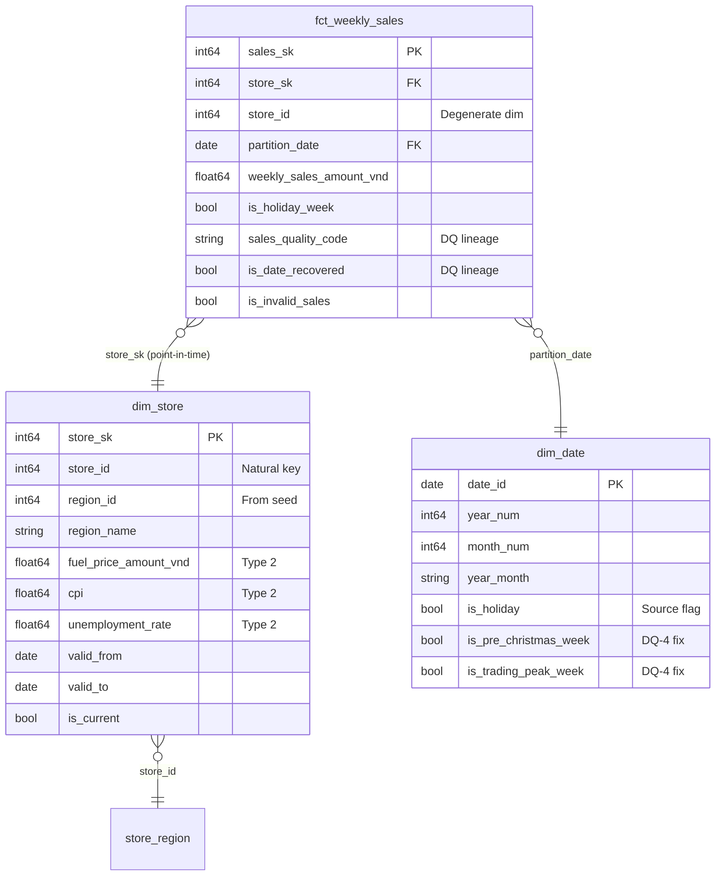

# Stage 1: Engineering & Refactoring - Detailed Report

**Goal:** Prove you can build a scalable foundation.

> Every figure in this report is reproducible. `scripts/verify_insights.py` recomputes the
> whole pipeline from `raw/bia_data.csv` in DuckDB, independently of BigQuery, and prints
> each number quoted here.

**The source, precisely:** 6,435 rows = 45 stores x 143 weekly snapshots, 2019-02-01 to
2021-10-22. Every week-ending date is a Friday. No duplicate (store, week) pairs.

---

## 1. Data Quality Audit

*Identify 3 critical issues in the data source (`bi_data.csv`) that would break an automated pipeline.*

> **Answering with four.** The brief asks for three, and DQ-1 to DQ-3 below are those three
> — they break a pipeline loudly. DQ-4 is included because it is the one that would have
> cost the most: it breaks nothing, passes every schema test, and quietly inverts a
> commercial conclusion. A data-quality audit that only looks for crashes would have
> shipped it.

Four issues were found. The first three are the ones the brief asks for; the fourth is the
one that would have done the most commercial damage, because it does not break a pipeline
at all -- it silently inverts an answer.

### DQ-1: An impossible date that cannot be repaired by string replacement

One row carries `Week_ending_date = '14/13/2019'` (store 42). Month 13 does not exist, so
`PARSE_DATE` aborts the run.

The tempting fix is a string substitution -- and it is wrong. Replacing `'13/2019'` with
`'12/2019'` yields **2019-12-14, a Saturday**, when all 143 other weeks in the feed end on a
Friday. It would insert the only off-cadence week in the dataset, and because every
downstream mart uses `ROWS BETWEEN` window frames, that phantom row shifts store 42's entire
`LAG` and rolling-average sequence by one position.

The true date is recoverable with certainty, from three independent directions:

| Evidence | Finding |
| --- | --- |
| **Cadence** | Store 42 has 142 valid weeks where every other store has 143. Its single gap is **2019-06-14** (it jumps 06-07 to 06-21). |
| **Unemployment** | The row reads `9.524`. For store 42 that value occurs *only* between 2019-03-29 and 2019-06-21. December 2019 reads 9.003. |
| **CPI** | The row reads `126.114`, interpolating precisely between 2019-06-07 (126.112) and 2019-06-21 (126.127). December 2019 sits at 126.79-127.09. |

The day-of-month (14) was intact; only the month digit was corrupt. Recovered as
`2019-06-14` in `stg_weekly_sales.sql`, with an `is_date_recovered` flag so the
reconstruction is never invisible to a downstream consumer.

**The durable fix is the test, not the patch.** A cadence assertion now fails the build if
any future date lands off-Friday:

```yaml
- dbt_utils.expression_is_true:
    arguments:
      expression: "EXTRACT(DAYOFWEEK FROM partition_date) = 6"
```

### DQ-2: A negative sales value

Store 45, 2019-03-19: `-791,835.37`. Almost certainly a returns or correction entry. Left in
place, it corrupts every `SUM`, and it silently poisons any window function whose frame
spans it.

### DQ-3: Nulls and unsafe casts

Three null cells (`Weekly_Sales` on store 44/2019-02-22, `Is_holiday_week` on store
44/2019-04-19, `Fuel_price` on the DQ-1 row). More dangerous than the nulls themselves was
the original use of bare `CAST`: a single malformed string anywhere in five columns aborts
the whole run. Every cast is now `SAFE_CAST`.

DQ-2 and DQ-3 share one handling principle -- **flag, never drop** -- so lineage stays
complete and any exclusion can be explained later:

```sql
CASE
    WHEN SAFE_CAST(Weekly_Sales AS FLOAT64) IS NULL THEN 'MISSING'
    WHEN SAFE_CAST(Weekly_Sales AS FLOAT64) < 0    THEN 'NEGATIVE'
    WHEN SAFE_CAST(Weekly_Sales AS FLOAT64) = 0    THEN 'ZERO'
    ELSE 'VALID'
END AS sales_quality_code
```

A reason code beats a bare boolean: `is_invalid_sales` tells you a row was excluded,
`sales_quality_code` tells you why. Both ship, and `data_quality_log.csv` publishes every
affected row to the dashboard.

### DQ-4: A flag that inverts the commercial truth

`Is_holiday_week` marks four events a year and is *calendar*-correct. It is
*commercially* inverted around Christmas:

| Week ending | Network sales | vs average week | Flagged as holiday? |
| --- | --- | --- | --- |
| **2019-12-20** | **80.9M** | **1.72x** | **No** |
| 2019-12-27 | 40.4M | 0.86x | Yes |
| **2020-12-18** | **77.0M** | **1.63x** | **No** |
| 2020-12-25 | 46.0M | 0.98x | Yes |

The flag marks the dead week *after* Christmas and misses the single largest trading week in
the dataset, which falls the week *before*. Any analyst segmenting on `is_holiday_week = TRUE`
would conclude that Christmas depresses sales.

This one passes every schema test -- no nulls, no type errors, no duplicates -- which is
exactly why it matters: **data quality is not only about what breaks a pipeline, it is about
what quietly produces a confident wrong answer.** `dim_date` now publishes
`is_pre_christmas_week` and `is_trading_peak_week` alongside the raw flag, and this gap is the
strongest argument for the promo-calendar table proposed in section 3.

---

## 2. Schema Refactoring

*Design a Star Schema (Fact and Dimension tables) to store this data. Provide the DDL or a diagram. Why is this better for a BI tool like Looker or Tableau?*

The flat CSV was decomposed into a Kimball dimensional model. No intermediate (`int_`) layer
was built, deliberately: the grain never changes between staging and the fact table, so an
intermediate layer would add lineage hops without adding meaning.

### The Star Schema Architecture

* **Fact:** `fct_weekly_sales` -- grain **1 row = 1 store x 1 week**. Monthly-partitioned on
  `partition_date`, clustered on `store_id`. Carries the sales measure plus data-quality
  lineage (`sales_quality_code`, `is_date_recovered`).
* **`dim_store`** -- SCD Type 2 mechanics (`store_sk` via `FARM_FINGERPRINT`, `valid_from` /
  `valid_to` via `LEAD`, `is_current`) over the weekly economic indicators, plus static
  region attributes joined from the `store_region` seed.
* **`dim_date`** -- calendar spine 2019-2026 carrying both the source holiday flag and the
  corrected trading-peak flags from DQ-4.

**An honest note on `dim_store`.** The tracked indicators (fuel price, CPI, unemployment) are
re-published by the source every single week, so this table versions weekly by construction.
That makes it a *weekly point-in-time snapshot* rather than a classic slowly-changing
dimension, and calling it plain "SCD2" would oversell it. The SCD2 *mechanics* are still what
make the point-in-time join exact, which is why they are retained. The textbook end-state --
a static `dim_store` plus a `fct_store_economics` at week grain, since these are weekly
measures rather than store attributes -- is deliberately deferred: a live Looker dashboard
reads these columns, so the change was kept additive. That trade-off is recorded rather than
hidden.

### Entity-Relationship Diagram



### BigQuery DDL

```sql
-- Dimension: dim_store (SCD Type 2 mechanics)
CREATE TABLE `the_iconic.dim_store` (
    store_sk INT64 NOT NULL,        -- Surrogate key: FARM_FINGERPRINT returns INT64
    store_id INT64 NOT NULL,        -- Natural key
    region_id INT64,                -- Static attribute (Type 1), from store_region seed
    region_name STRING,
    fuel_price_amount_vnd FLOAT64,  -- Type 2 attributes
    cpi FLOAT64,
    unemployment_rate FLOAT64,
    valid_from DATE NOT NULL,
    valid_to DATE NOT NULL,         -- 9999-12-31 sentinel when current
    is_current BOOL NOT NULL
)
CLUSTER BY store_id;

-- Fact: fct_weekly_sales
CREATE TABLE `the_iconic.fct_weekly_sales` (
    sales_sk INT64 NOT NULL,        -- Hash of store_id + partition_date
    store_sk INT64 NOT NULL,        -- FK to dim_store, resolved point-in-time
    store_id INT64 NOT NULL,        -- Degenerate dimension, kept for readability
    partition_date DATE NOT NULL,   -- FK to dim_date
    weekly_sales_amount_vnd FLOAT64 NOT NULL,
    is_holiday_week BOOL NOT NULL,
    sales_quality_code STRING NOT NULL,
    is_date_recovered BOOL NOT NULL,
    is_invalid_sales BOOL NOT NULL,
    loaded_at TIMESTAMP
)
PARTITION BY DATE_TRUNC(partition_date, MONTH)
CLUSTER BY store_id;
```

The point-in-time join that makes the SCD2 worthwhile:

```sql
LEFT JOIN dim_store sk
    ON  stg.store_id = sk.store_id
    AND stg.partition_date >= sk.valid_from
    AND stg.partition_date <  sk.valid_to
```

### Why is this better for Looker Studio / Tableau?

1. **Cost and latency.** Partitioning on `partition_date` and clustering on `store_id` means
   a dashboard filtered to one month scans one month, not three years. This is the single
   largest lever on BI cost, because dashboards re-query on every interaction.
2. **Point-in-time accuracy without fan-out.** Joining on `store_sk` attaches the macro
   conditions that were true *at the time of the sale*. Joining on `store_id` alone would
   multiply every fact row by the number of versions -- a silent, plausible-looking
   overstatement.
3. **One definition of a metric.** "Weekly sales" is defined once, in the fact table, with
   `is_invalid_sales` applied consistently by every mart. In the flat CSV, each analyst
   re-decides whether to include that -791,835 row, and the numbers in two decks stop
   matching.
4. **Conformed dimensions make the model extensible.** `dim_date` and `dim_store` are shared
   by all five marts, so the three external tables proposed below attach to the existing
   grain instead of requiring the fact table to be rebuilt.

---

## 3. Proposed Data Ecosystem

*Suggest 3 specific external tables you would join to this data to better explain sales variance. Define the Join Keys.*

The recurring failure mode with external joins is **granularity mismatch**: joining a
coarser table on a partial key multiplies fact rows and inflates every measure. Each proposal
below therefore states its grain first, and the join key second.

`region_id` is a real column on `dim_store` (sourced from the `store_region` seed), so these
joins are implementable today rather than theoretical. The region values themselves are a
documented synthetic placeholder -- the source feed carries no geography -- which is stated in
the seed's own description rather than left for a reviewer to discover.

### 1. `dim_marketing_spend` (Source: Google / Meta Ads API)

* **Granularity:** `partition_date` + `region_id` (one row per region-week).
* **Join Key:** `fct_weekly_sales` -> `dim_store` to resolve `region_id`, then join on
  (`partition_date`, `region_id`).
* **Fan-out risk:** joining on `partition_date` alone against a region-grain table multiplies
  every fact row by the number of regions -- a 4x phantom uplift with no error raised.
* **Value:** separates paid-driven spikes from organic demand, and gives ROAS by region. It
  is also the direct fix for DQ-4: a real promo calendar would have flagged the pre-Christmas
  peak that the source's holiday field misses.

### 2. `dim_weather_indices` (Source: OpenWeatherMap API)

* **Granularity:** `store_id` + `partition_date`, aggregated to the week (mean temperature,
  total precipitation, severe-weather day count).
* **Join Key:** (`store_id`, `partition_date`) -- already the exact grain of the fact table,
  so this is the only one of the three that carries no fan-out risk.
* **Value:** reduces false-positive anomalies. Of the 10 negative anomalies now detected,
  weather would immediately separate "storm closed the store" from "investigate operations."

### 3. `dim_competitor_pricing` (Source: Retail intelligence / scraping)

* **Granularity:** `partition_date` + `region_id` + `category_id`.
* **Join Key:** (`partition_date`, `region_id`) via `dim_store`. **Note the residual
  mismatch:** this table is finer than the fact table on `category_id`, so it must be
  pre-aggregated to region-week *before* joining, or the fact rows multiply by category count.
* **Value:** distinguishes share loss caused by a competitor's discounting from internal
  operational failure -- currently indistinguishable, since both look like a negative z-score.

**Grain summary:**

| Table | Grain | Join key | Fan-out risk |
| --- | --- | --- | --- |
| `dim_marketing_spend` | region-week | `partition_date` + `region_id` | 4x if joined on date alone |
| `dim_weather_indices` | store-week | `store_id` + `partition_date` | None (exact grain match) |
| `dim_competitor_pricing` | region-category-week | `partition_date` + `region_id` | Requires pre-aggregation over category |
