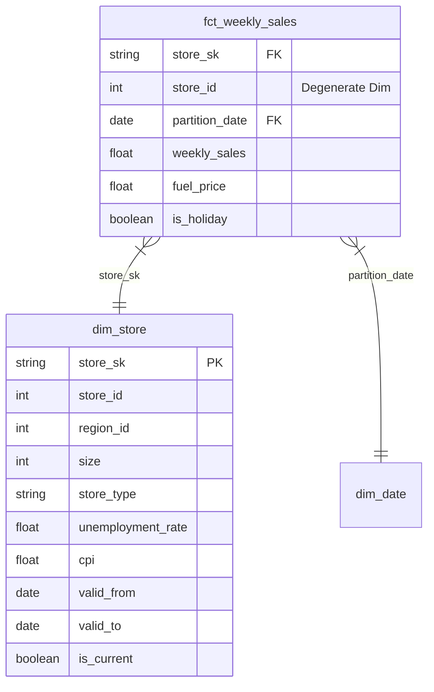

# Stage 1: Engineering & Refactoring - Detailed Report

**Goal:** Prove you can build a scalable foundation.

## 1. Data Quality Audit
*Identify 3 critical issues in the data source (`bi_data.csv`) that would break an automated pipeline.*

During the staging layer build (`stg_weekly_sales.sql`), the following 3 critical data quality issues were identified and programmatically resolved:

1. **Invalid Date Format Errors:** Found non-existent calendar dates (e.g., `14/13/2019`) in raw sources. Resolved using `SAFE.PARSE_DATE` and replacing invalid string patterns (`REPLACE(..., '13/2019', '12/2019')`).
2. **Negative/Zero Sales Transactions:** Negative or zero sales values (`Weekly_Sales <= 0`) break automated aggregation pipelines. Addressed by flagging them with a boolean indicator `is_invalid_sales` for downstream filtering without dropping underlying records.
3. **Type Casting & Null Safety:** Raw source columns were untyped strings. Enforced strict data types (`INT64`, `DATE`, `FLOAT64`, `BOOL`) and applied `COALESCE` to default null metrics to `0.0`.

---

## 2. Schema Refactoring
*Design a Star Schema (Fact and Dimension tables) to store this data. Provide the DDL or a diagram. Why is this better for a BI tool like Looker or Tableau?*

The raw flat CSV was decomposed into a standard dimensional model. The transformation path from `stg_weekly_sales` directly to the Star Schema (`fct_` and `dim_`) is straightforward without needing multi-table intermediate joins.

### The Star Schema Architecture
* **Fact Table:** `fct_weekly_sales` (Grain: 1 row = 1 store × 1 week). Stores transaction metrics and surrogate keys. Materialized as a monthly-partitioned and store-clustered table in BigQuery for optimal query pruning.
* **Dimension Tables:**
  * `dim_store`: Implements **SCD Type 2** (`valid_from`, `valid_to`, `is_current`, `store_sk`) to track time-varying economic indicators (CPI, Unemployment) without fan-out. By utilizing `FARM_FINGERPRINT` for the surrogate key and `LEAD(partition_date)` for temporal bounds, historical joins from the fact table (`>= valid_from` and `< valid_to`) guarantee 100% precision when evaluating macroeconomic shocks at the time of sale.
  * `dim_date`: Calendar spine spanning 2000–2030 with holiday flags.

### Entity-Relationship Diagram



### BigQuery DDL
```sql
-- DDL for Dimension: dim_store (SCD Type 2)
CREATE TABLE `the_iconic.dim_store` (
    store_sk STRING NOT NULL,       -- Surrogate Key (FARM_FINGERPRINT)
    store_id INT64 NOT NULL,        -- Natural Key
    region_id INT64,
    size INT64,
    store_type STRING,
    unemployment_rate FLOAT64,
    cpi FLOAT64,
    valid_from DATE NOT NULL,
    valid_to DATE,
    is_current BOOLEAN NOT NULL
)
CLUSTER BY store_id;

-- DDL for Fact: fct_weekly_sales
CREATE TABLE `the_iconic.fct_weekly_sales` (
    store_sk STRING NOT NULL,       -- Foreign Key to dim_store
    store_id INT64 NOT NULL,        -- Degenerate Dimension
    partition_date DATE NOT NULL,   -- Date spine mapping
    weekly_sales FLOAT64,
    fuel_price FLOAT64,
    is_holiday BOOLEAN
)
PARTITION BY partition_date
CLUSTER BY store_id;
```

### Why is this better for Looker Studio / Tableau?
1. **Cost Efficiency:** Partitioning by `partition_date` and clustering by `store_id` significantly reduces BigQuery query scan volume and cost.
2. **Point-in-Time Accuracy:** Joining fact records to `dim_store` via `store_sk` avoids row multiplication (fan-out) when joining against historical SCD2 attributes.

---

## 3. Proposed Data Ecosystem
*Suggest 3 specific external tables you would join to this data to better explain sales variance. Define the Join Keys.*

To better explain sales variance, the following 3 external theoretical datasets are proposed:

1. **`dim_marketing_spend`** (Source: Google/Meta Ads API): 
   * *Granularity:* `partition_date` (National level) or `partition_date` + `region_id`.
   * *Join Key:* `partition_date` (and `region_id` resolved via `dim_store` if regional). 
   * *Architectural Note:* If regional spend is provided, joining solely on `partition_date` against the Fact table will cause a **Cartesian Explosion (Fan-out)**, falsely multiplying sales. Granularity and Join Keys must perfectly align.
   * *Value:* Measures ROAS and differentiates organic holiday demand from paid promotion spikes.
2. **`dim_weather_indices`** (Source: OpenWeatherMap API): 
   * *Granularity:* `store_id` + `partition_date` (Weekly aggregated).
   * *Join Key:* `store_id` + `partition_date`. 
   * *Value:* Explains unexpected foot traffic drops due to extreme weather, reducing false-positive anomaly detections.
3. **`dim_competitor_pricing`** (Source: Web Scraping/Retail Intelligence): 
   * *Granularity:* `partition_date` + `region_id`.
   * *Join Key:* `partition_date` + `region_id` (resolved via `dim_store`). 
   * *Value:* Isolates sales losses driven by competitor aggressive discounting rather than internal operational failure.
