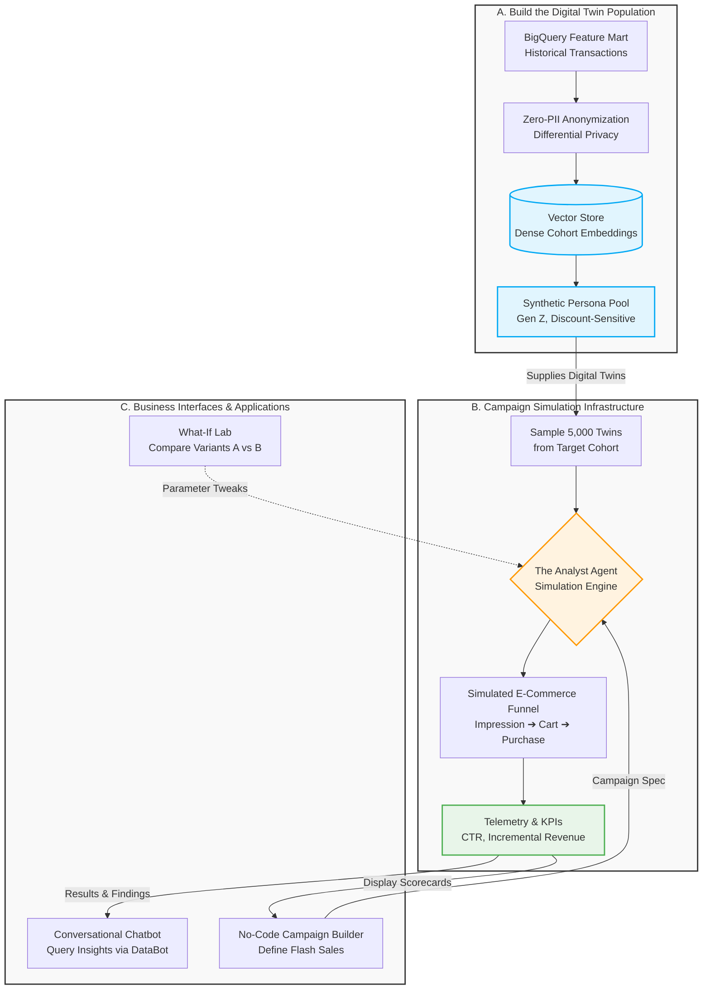

# PROPOSAL: CAMPAIGN SIMULATION AGENT & DIGITAL CUSTOMER TWINS
**Project:** Zero-PII Campaign Sandbox & AI Analytics Agent Platform  
**Author:** Senior Analytics Engineer / BI Lead  
**Target Audience:** THE ICONIC Executive Leadership (Marketing, E-commerce, Merchandising & Supply Chain Teams)  
**Methodological Foundation:** Inspired by State-of-the-Art Research in Population-Scale Agentic Simulation (notably the *MatrAIx Framework*, Harvard/MIT/Stanford, 2026)

---

## EXECUTIVE SUMMARY

In high-velocity fashion e-commerce like THE ICONIC, live A/B testing for marketing campaigns typically requires **2–4 weeks**, consumes actual media spend, risks customer fatigue or backlash, and exposes sensitive Personally Identifiable Information (PII). Furthermore, the fashion industry's short product lifecycles, extreme seasonality (e.g., Black Friday, Lunar New Year), and severe SKU-level inventory risks (overstock vs. understock) demand a faster, safer experimentation paradigm.

This proposal introduces **The Analyst Agent ("DataBot")** operating as a **Campaign Simulation Agent** powered by **Digital Customer Twins**. Grounded in recent research on population-scale user simulation (*MatrAIx framework*, 2026), the platform initializes synthetic virtual user cohorts using latent feature embeddings from BigQuery. By enabling business stakeholders to simulate campaign parameters, test promotional elasticity, and evaluate revenue cannibalization **within 3–5 minutes**, THE ICONIC can eliminate media waste and accelerate time-to-insight **without touching production transactional databases, ensuring Zero-PII by design within the simulation sandbox**.

---

## 1. BUSINESS CASE & INDUSTRY CONTEXT

### 1.1. Traditional A/B Testing vs. Campaign Simulation Agent

| Evaluation Criteria | Traditional Live A/B Testing | Campaign Simulation Agent (Proposed) |
| :--- | :--- | :--- |
| **Time-to-Insight** | **2 – 4 weeks** (waiting for live transactions) | **3 – 5 minutes** (instant feedback loop) |
| **Financial & Brand Risk** | Consumes real media budget; risks customer fatigue if promo logic fails | **100% synthetic budget**; zero risk to live customer experience |
| **Data Privacy & Security** | Direct production queries; risks PII exposure | **Zero-PII Sandbox**; works exclusively on dense Vector Embeddings |
| **Data Team Dependency** | **High** (marketers queue SQL extraction tickets) | **Self-service** via No-Code UI and natural language AI Agent |

### 1.2. Fashion E-Commerce Dynamics
* **Extreme Seasonality:** Peak shopping windows (Cyber Week, Lunar New Year, Back-to-School) are extremely narrow. Traditional 2-week A/B tests often miss these critical promotional windows.
* **Category & SKU Inventory Risk:** Aggressive discounting on core categories (e.g., Sneakers) can trigger stockouts on anchor SKUs while cannibalizing full-price sales across adjacent fashion lines.
* **Pre-order & Assortment Testing:** Merchandising teams can simulate customer cohort reactions to new collection colors and price points before placing volume purchase orders with manufacturers.

---

## 2. SYSTEM ARCHITECTURE (6-COMPONENT FRAMEWORK)

The platform operates as a closed-loop sandbox, completely isolated from sensitive production transactional databases:



### Component Breakdown:

* **2.1. Data Foundation & Vector Store:**
* *Input:* Historical behavioral features (RFM, purchase frequency, price sensitivity, category affinity) from BigQuery.
* *Processing:* Encodes attributes into dense Vector Embeddings ($128 \rightarrow 512$ dimensions) via a Customer Encoder.
* *Storage:* Stored in a Vector Database (Pinecone / Weaviate). Strips all PII (Name, Email, Phone, Address); retains only `segment_id`, `vector`, and aggregate statistical properties.


* **2.2. Digital Twin Generator:**
* Spawns $n = 1,000 \rightarrow 10,000$ synthetic user agents (Digital Twins) representing a target segment (e.g., *"Female, 18–24, HCMC, High Sneaker Affinity, Discount-Sensitive"*).
* Each twin maintains a synthetic persona and behavioral decision rules (click-through propensity, discount sensitivity, cart abandonment threshold).


* **2.3. Campaign Config Interface (No-Code Builder):**
* Business users input campaign parameters: Campaign Type (Flash Sale, Collection Launch, Clearance), Channel (In-App Push, Email, Meta Ads), and Offer Details (Discount %, Freeship Threshold).


* **2.4. MatrAIx-Inspired Simulation Engine & Task Verifier:**
* Injects campaign specs into the synthetic environment. Following MatrAIx-inspired task specification patterns ($\tau = \langle \pi, \theta, \alpha, \mu, \sigma \rangle$, representing persona $\pi$, task $\theta$, agent interface $\alpha$, model parameters $\mu$, and random seed $\sigma$), thousands of twins process the stimulus and execute probabilistic interactions: *Impression $\rightarrow$ Click/Skip $\rightarrow$ View Product $\rightarrow$ Add to Cart $\rightarrow$ Purchase/Abandon*.
* Features an **Automated Outcome Verifier** that logs event streams, verifies logical consistency (e.g., preventing cart checkout without add-to-cart events), and outputs predicted metrics (CTR, CVR, AOV, Incremental Revenue, Cannibalization Risk).


* **2.5. The Analyst Agent (DataBot):**
* The primary conversational AI Agent interface for business stakeholders to query, alter, and extract insights from simulation results.


* **2.6. Continuous Calibration Loop:**
* Following actual small-scale live pilot launches, real-world metrics are fed back to recalibrate the behavioral weights of the Digital Twins for future iterations.


---

## 3. THE ANALYST AGENT ARCHITECTURE (DATABOT)

> **Core Role:** The Analyst Agent (DataBot) serves as the primary conversational intelligence interface requested in Stage 4. All supporting components (Vector Stores, Digital Twins, Simulation Engine) function as the underlying infrastructure serving this Agent.

### 3.1. Specialized Toolset & Function Signatures

DataBot operates equipped with 5 dedicated tools that interact exclusively with the **Simulation Result Store**, ensuring no direct access to production databases:

1. `query_simulation_result(segment_id: str, campaign_id: str, metrics: list[str])`
* *Description:* Fetches aggregate predicted performance metrics (CTR, CVR, AOV, Margin Impact) for a completed simulation.


2. `what_if_calculator(campaign_spec: dict, segment_id: str, parameter_to_change: dict)`
* *Description:* Re-runs instantaneous simulation cycles when business users alter single or multi-variable parameters (e.g., discount %, freeship threshold).


3. `segment_comparator(campaign_id: str, segment_ids: list[str])`
* *Description:* Evaluates campaign responsiveness and elasticity across different customer cohorts.


4. `root_cause_analyzer(campaign_id: str, segment_id: str)`
* *Description:* Synthesizes the simulated "internal monologue" logs of Digital Twins to explain why a specific cohort rejected an offer.


5. `knowledge_lookup(policy_doc_id: str)`
* *Description:* Retrieves internal business policies, minimum gross margin thresholds, and promotional guidelines for THE ICONIC.


### 3.2. Sample Multi-Turn Slack Conversation Flow

```text
[Marketing Manager]: DataBot, I just ran a simulation for a 15% Off Sneaker Flash Sale targeting Gen Z in HCMC. What are the projected results?

[DataBot]: 
⚙️ Executing tool: query_simulation_result(segment_id="genz_sneaker_hcmc", campaign_id="flash_sale_15pct", metrics=["CTR", "CVR", "AOV", "Incremental_Revenue"])
--------------------------------------------------------------------------------
Here are the projected simulation results (Cohort sample size: 5,000 Digital Twins):
• Projected CTR: 8.2%
• Conversion Rate (CVR): 3.5%
• Average Order Value (AOV): 1,200,000 VND
• Projected Incremental Revenue: 210,000,000 VND
• Full-Price Cannibalization Risk: 12%

[Marketing Manager]: What happens to CVR and overall profitability if I increase the discount voucher to 20%?

[DataBot]: 
⚙️ Executing tool: what_if_calculator(campaign_spec={"offer": "20% off", "category": "Sneaker"}, segment_id="genz_sneaker_hcmc")
--------------------------------------------------------------------------------
I re-ran the "What-If" simulation with a 20% discount. Here is the comparison:
• CVR increases from 3.5% ➔ 4.8% (+37% order volume).
• However, Gross Margin drops by 15%.
• Incremental Revenue rises marginally to 220,000,000 VND (+10M VND), failing to offset the margin compression.

⚙️ Executing tool: root_cause_analyzer(campaign_id="flash_sale_20pct", segment_id="genz_sneaker_hcmc")
--------------------------------------------------------------------------------
📌 Root Cause Report: 68% of Digital Twins that abandoned carts did so due to "High shipping fees on orders under 1M VND", not discount magnitude.
💡 Strategic Recommendation: RETAIN the 15% discount, but introduce "Freeship on all Sneaker orders". This is projected to push CVR to 4.2% while protecting gross margin!

```

---

## 4. DATA PRIVACY, SECURITY & GOVERNANCE

To strictly adhere to global privacy regulations (GDPR, Australian Privacy Principles):

* **Zero-PII Sandbox by Design:** PII risk within the simulation environment is eliminated by design. Digital Twins store purely synthetic cohort personas that preserve the statistical distributions of the real population without retaining real names, phone numbers, or addresses. *(Note: PII risk elimination applies strictly to the simulation sandbox scope; overall organizational PII compliance relies on separate governance controls in CRM, ESP, and production analytics pipelines).*
* **Differential Privacy (DP):** Injects calibrated mathematical noise into feature vectors, preventing reverse-engineering or re-identification attacks.
* **Generative Adversarial Networks (GANs):** Generates synthetic cohort personas matching real population behavioral mechanics.
* **Data & Model Governance:**
* **Model Versioning & Run Manifests:** Inspired by research reproducibility standards, every simulation run records an immutable **Run Manifest** containing the persona pool version, prompt template version, model parameters, and random seed to guarantee $100\%$ auditability and reproducibility.
* **Role-Based Access Control (RBAC):** Every simulation run, user query, and generated recommendation is logged with timestamping and user attribution for compliance auditing.


---

## 5. 4-LAYER VALIDATION FRAMEWORK (RESEARCH-GROUNDED)

To ensure simulation reliability before committing real capital, the system undergoes rigorous 4-layer validation combining standard business KPIs with research-grounded benchmarks:

| Validation Layer | Core Evaluation Question | Methodology | Target Metric |
| --- | --- | --- | --- |
| **1. Statistical & Persona Fidelity** | Do twins mirror real statistical properties and hold character consistently? | • Compare RFM, price sensitivity, and category affinity distributions via **KS-test** and **Chi-Square**.<br><br>• **Persona Adherence Test:** Test persona role-playing consistency under behavioral stress tests. | • Max KS Statistic $< 0.1$<br><br>• Chi-Square $p\text{-value} > 0.05$<br><br>• **Behavioral Adherence Rate $\ge 90\%$** *(Target inspired by MatrAIx benchmarks)* |
| **2. Behavioral Fidelity & Heterogeneity** | Do twins react realistically to stimuli and differentiate across cohorts? | • **Historical Campaign Replay:** Re-run 5–10 past campaigns on twins vs actuals.<br><br>• **Subgroup Heterogeneity Analysis:** Verify distinct variance in CTR/CVR across cohorts (e.g., Gen Z vs Millennials). | • Relative Error (CTR/CVR) $< 10\% - 15\%$<br><br>• Pearson Correlation $r \ge 0.7$<br><br>• Statistically significant variance between distinct cohorts ($\chi^2$ $p < 0.05$) |
| **3. Predictive Validity** | Does selecting the top simulation variant yield superior real-world lift? | Deploy Top-1/2 simulation variants to a small live pilot audience ($10\%$ cohort sample). Compare predicted vs. actual lift. | • Lift Prediction Error $< 20\%$<br><br>• Spearman Rank Correlation $\ge 0.7$ |
| **4. Decision Utility** | Does simulation improve the speed, quality, and efficiency of business decisions? | Track decision speed, number of pre-launch variants tested, and post-launch campaign failure rates. | • Time-to-insight reduced $> 50\%$<br><br>• Underperforming campaigns reduced $> 30\%$ |

---

## 6. LIMITATIONS & EXECUTIVE GUARDRAILS

A mature data culture requires defining explicit guardrails on **when NOT to trust simulation outputs**:

```text
               ┌──────────────────────────────────────────────────────────┐
               │    CRITICAL RULE FOR EXECUTIVE DECISION MAKING           │
               │ "Simulation is a Hypothesis Generator, Not an Oracle.    │
               │  Every major launch MUST have at least 1 non-synthetic   │
               │  data source (Real Pilot / User Interview) to validate." │
               └──────────────────────────────────────────────────────────┘

```

1. **Novel Behavior & New Category Contexts:** Twins trained on historical data predict poorly for completely novel product categories. *Guardrail:* Use simulation strictly for hypothesis generation; mandate small-scale real pilots for entirely novel concepts.
2. **Deep Psychographics & Emotional Nuance:** Twins describe emotions rather than experiencing them. *Guardrail:* Do not use simulation as the sole input for Brand Positioning or Brand Equity decisions; combine with qualitative focus groups.
3. **Data Bias & Underrepresented Segments:** Historical data bias (e.g., sparse data for Male 35+ cohorts) results in skewed twin behavior. *Guardrail:* Implement automated Low Confidence Warnings when simulating underrepresented segments.
4. **Concept Drift & Seasonality:** Fashion trends evolve rapidly. *Guardrail:* Schedule mandatory model recalibration quarterly and post-major shopping events (Black Friday).
5. **Over-Reliance Risk:** Business teams risking passive reliance on simulation outputs. *Guardrail:* Enforce policy that major campaign budgets require endorsement from at least 1 non-synthetic data point.
6. **Compute Cost & Operational Complexity:** Large-scale twin execution can accumulate compute overhead. *Guardrail:* Utilize sampling ($n = 5,000$ twins) and cache simulation results for standard campaign templates.

---

## 7. 90-DAY IMPLEMENTATION ROADMAP

To deliver rapid time-to-value without embarking on an open-ended technology project, the roadmap focuses on proving ROI on a narrow use-case before scaling:

```text
[ Month 1: Narrow PoC ] ────────► [ Month 2: Expansion & Pilot ] ────────► [ Month 3: Rollout & Governance ]
 • Feature Mart vectorization     • Expand to 3 Segments & 2 Campaign    • Onboard Marketing & Merchandising
 • PoC on 1 Segment (Gen Z        Types (Flash Sale + Collection)        • Measure Decision Utility KPIs
   Sneaker Lovers)                • Build Slack Bot & basic UI           • Establish RBAC, audit logging,
 • Generate 1,000 Twins & test    • Run 1-2 live pilots to validate       and model versioning
   historical replay                Predictive Validity                  • Handover & ROI assessment
 • Target: Relative Error < 15%

```

---

## 8. EXPECTED BUSINESS IMPACT & ROI

* **Marketing Spend Optimization:** Expected reduction of up to **20% in media budget waste** after 2–3 campaign cycles as twins are calibrated, in line with reported agentic simulation benchmarks.
* **Accelerated Decision Velocity:** Reduces time-to-insight from **3 weeks to 3–5 minutes**, expanding pre-launch testing capacity by 10x.
* **Inventory Risk Reduction:** Assists Merchandising teams in forecasting category-level demand prior to committing capital to manufacturing volume orders.
* **Data Security:** Achieves **Zero-PII exposure by design** within the business campaign testing sandbox.

---

## APPENDIX A: UX/UI WIREFRAMES & APPLICATION WORKFLOW

To contextualize the end-product for engineering and product teams, below is the text-based wireframe and layout for the DataBot Web Application (e.g., React/Next.js dashboard).

### A.1 Global Layout
```text
+---------------------------------------------------------------+
|  [Logo]  Campaign Simulation Agent                    [User]  |
+---------------------------------------------------------------+
| Sidebar           |  Content Area                             |
| ------------------|------------------------------------------ |
| - Dashboard       |                                           |
| - Campaign Builder|                                           |
| - Results         |                                           |
| - What-If Lab     |                                           |
| - Segments        |                                           |
| - History         |                                           |
| - Settings        |                                           |
+-------------------+-------------------------------------------+
```

### A.2 Dashboard (Home)
**Purpose:** Quick overview of the system, recent campaigns, and actionable shortcuts.
```text
+---------------------------------------------------------------+
|  Dashboard                                                    |
+---------------------------------------------------------------+
|  Quick Stats                                                  |
|  - Total simulations run (MTD): 124                           |
|  - Avg time-to-insight: 3.2 minutes                           |
|  - Top segment by usage: Gen Z Sneaker Lovers                 |
+---------------------------------------------------------------+
|  Recent Simulations                                           |
|  -----------------------------------------------------------  |
|  | Campaign Name          | Segment         | Date       |   |
|  | Flash Sale 15% Sneaker | Gen Z Sneaker   | 2026-08-09 |   |
|  | New Collection Dress   | Millennials     | 2026-08-08 |   |
|  -----------------------------------------------------------  |
|  [View All History]                                           |
+---------------------------------------------------------------+
|  Quick Actions                                                |
|  [New Simulation]  [What-If Lab]  [Ask DataBot]               |
+---------------------------------------------------------------+
```
*Interaction:* "New Simulation" routes to Campaign Builder. Clicking a recent campaign opens its Result Dashboard. "Ask DataBot" opens the global chat panel.

### A.3 Campaign Builder (No-Code Config)
**Purpose:** Interface for business users to configure campaign parameters for simulation.
```text
+---------------------------------------------------------------+
|  Step 1: Select Segment                                       |
|  [Dropdown] Gen Z Sneaker Lovers – HCMC                       |
|  -> Preview: Cohort size: 5,000 | Avg AOV: 1.1M | 68% Discount-sensitive |
+---------------------------------------------------------------+
|  Step 2: Campaign Details                                     |
|  - Type: [Dropdown] Flash Sale / Clearance / Loyalty          |
|  - Channel: [Checkbox] In-App Push, Email, Meta Ads           |
|  - Discount: [Slider] 5% - 40%                                |
|  - Freeship Threshold: [Input] VND                            |
+---------------------------------------------------------------+
|  Step 3: Creative Preview                                     |
|  - Headline / Subtext: [Input]                                |
|  - Image: [Upload / Template]                                 |
+---------------------------------------------------------------+
|  [Save as Draft]  [Run Simulation]                            |
+---------------------------------------------------------------+
```

### A.4 Simulation Run & Results Dashboard
**Progress Screen (Execution Phase):**
```text
+---------------------------------------------------------------+
|  Running Simulation: Flash Sale 15% Sneaker                   |
+---------------------------------------------------------------+
|  Spawning 5,000 Digital Twins...                              |
|  Running interactions... 32% complete (~1 min remaining)      |
|                                                               |
|  Agent Activity Log (Thought Process):                        |
|  - Calculating CTR for segment Gen Z...                       |
|  - Estimating cannibalization risk...                         |
+---------------------------------------------------------------+
```

**Results Screen (Post-Execution):**
```text
+---------------------------------------------------------------+
|  Results: Flash Sale 15% Sneaker – Gen Z Sneaker Lovers       |
+---------------------------------------------------------------+
|  Key Metrics: CTR: 8.2% | CVR: 3.5% | AOV: 1.2M VND           |
|  Incremental Revenue: 210M VND | Cannibalization Risk: 12%    |
+---------------------------------------------------------------+
|  Funnel Chart: Impression → Click → View → Cart → Purchase    |
+---------------------------------------------------------------+
|  [Ask DataBot]  [Run What-If]  [Export PDF/CSV]               |
+---------------------------------------------------------------+
```

### A.5 DataBot Chat Panel (AI Analyst Agent)
**Purpose:** Conversational interface for querying results, generating insights, and recommending actions.
```text
+---------------------------------------------------------------+
|  DataBot – Analyst Agent                                      |
+---------------------------------------------------------------+
|  User: Is this campaign worth it compared to the baseline?    |
|                                                               |
|  DataBot: Compared to the no-promo baseline, this projects:   |
|  - CTR: 8.2% (vs 4.5%)                                        |
|  - CVR: 3.5% (vs 1.8%)                                        |
|  - Incremental Revenue: 210M VND                              |
|  Recommendation: PROCEED, but limit stock on flagship SKUs.   |
+---------------------------------------------------------------+
|  [Input: Ask a follow-up question...]  [Send]                 |
|  Quick Actions: "What if discount = 20%?", "Why is CVR low?"  |
+---------------------------------------------------------------+
```

### A.6 What-If Lab
**Purpose:** Rapid testing of campaign variants without building from scratch.
```text
+---------------------------------------------------------------+
|  What-If Lab (Base: Flash Sale 15% Sneaker)                   |
+---------------------------------------------------------------+
|  Parameters to Change:                                        |
|  - Discount %: [15%] -> [20%]                                 |
|  - Freeship Threshold: [1M VND] -> [0 VND]                    |
|  [Run What-If Simulation]                                     |
+---------------------------------------------------------------+
|  Results Comparison:                                          |
|  | Metric   | Original | What-If | Change |                   |
|  | CVR      | 3.5%     | 4.8%    | +1.3pp |                   |
|  | Margin   | -        | -15%    |        |                   |
|  [Ask DataBot about What-If]  [Save as New Campaign]          |
+---------------------------------------------------------------+
```

### A.7 Segments Explorer & History/Audit Log
* **Segments Explorer:** Browse available synthetic cohorts (size, AOV, distribution charts for RFM and price sensitivity). Launch new simulations directly from a segment profile.
* **History & Audit Log:** Searchable log of all simulation runs (Campaign Spec, Twin version, User, Random seed) to ensure absolute reproducibility and governance.

---

## APPENDIX B: AGILE USER STORIES (PRODUCT BACKLOG)

To accelerate engineering hand-off, the core functionality is broken down into Agile User Stories.

**Epic 1: Campaign Builder & Simulation Execution**
* **US-1 (Create Campaign):** As a Marketing Manager, I want to create a new simulation by selecting a segment and configuring parameters, so that I can test ideas without spending real budget.
* **US-2 (Segment Preview):** As a Marketer, I want to see key statistics of the selected segment (cohort size, avg AOV) before running, so that I ensure I’m targeting the correct audience.
* **US-3 (Execution Progress):** As a Marketer, I want to see the progress of my simulation run (spawning twins, ETA) and the agent's thought process, so that I know the system is actively computing.

**Epic 2: Results & The AI Analyst (DataBot)**
* **US-4 (Result Scorecards):** As a Marketing Manager, I want to see key metrics (CTR, CVR, Incremental Revenue) and a funnel chart, so that I can instantly assess campaign viability.
* **US-5 (Conversational Queries):** As a Marketer, I want to ask DataBot questions about the results in natural language, so that I can extract insights without writing SQL.
* **US-6 (Actionable Recommendations):** As a Marketing Manager, I want DataBot to provide strategic recommendations (e.g., adjust channel mix), so that I can make better decisions faster.

**Epic 3: What-If Lab & Governance**
* **US-7 (Variant Testing):** As a Marketer, I want to tweak 1-2 parameters of a completed campaign and re-run it, so that I can find the mathematical optimum before launch.
* **US-8 (Audit Logging):** As a Data Lead, I want to see the full manifest of a simulation run (model version, random seed, chat transcript), so that I can audit and reproduce the result.
* **US-9 (RBAC & Policy Limits):** As a Finance Lead, I want to set minimum gross margin thresholds globally, so that DataBot can restrict recommendations that violate profitability guidelines.
