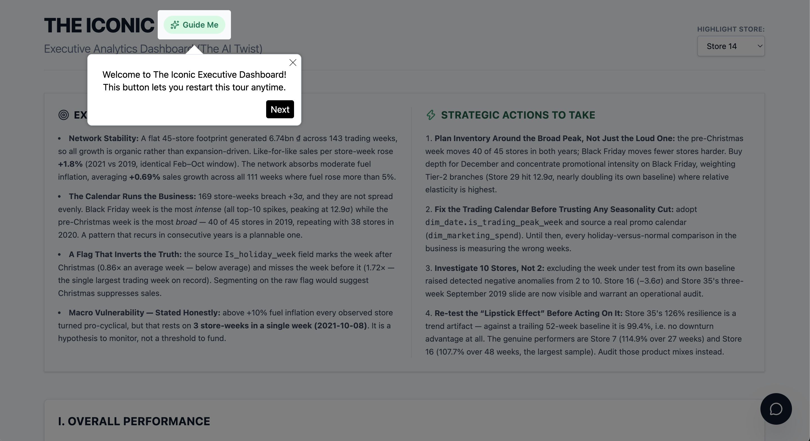
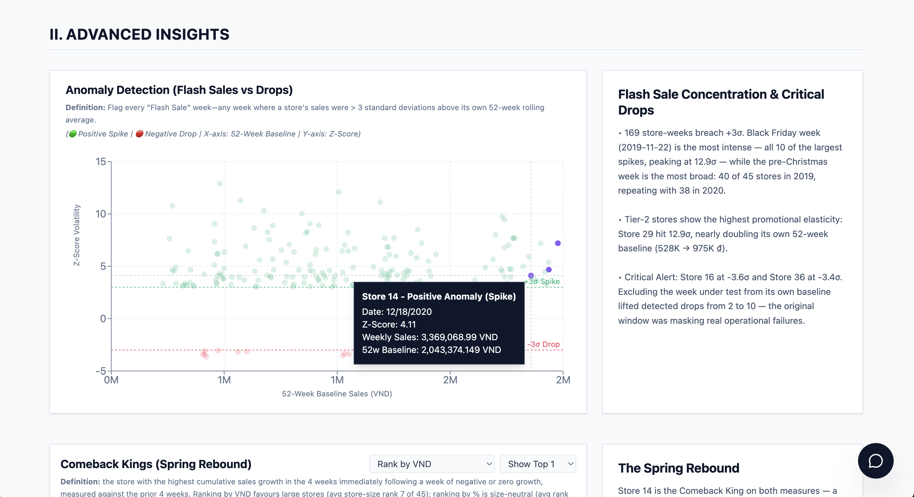
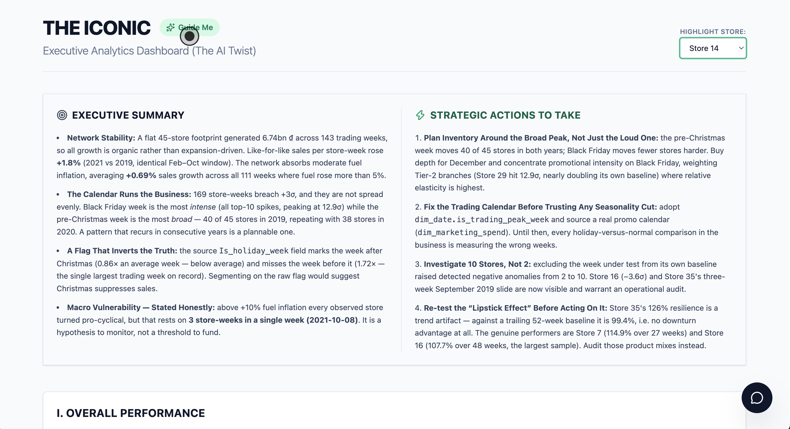
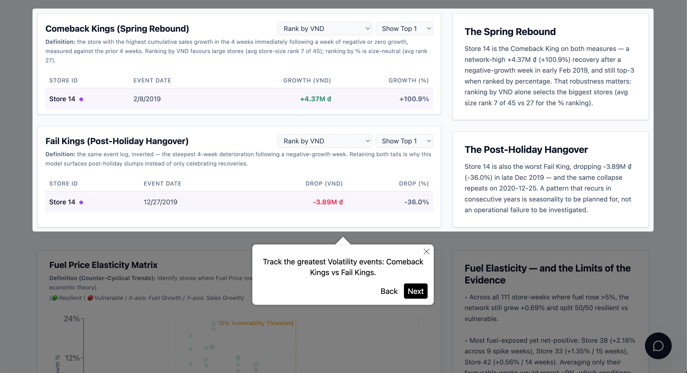
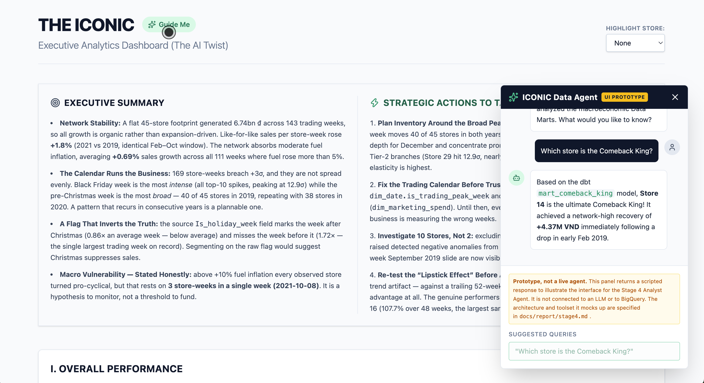

# The AI Twist: Executive Retail Dashboard

**Live Demo:** [https://the-ai-twist.vercel.app/](https://the-ai-twist.vercel.app/)

This is a standalone, interactive React web application built as part of **THE ICONIC BI & Data Insights Challenge (Stage 3)**. It serves as a dynamic presentation layer for the advanced macroeconomic and operational insights derived from the dbt Star Schema models.

## 🚀 Tech Stack

- **Framework:** React.js (Bootstrapped with Vite)
- **Styling:** Tailwind CSS v4
- **Data Visualization:** Recharts (Interactive Data Grids, Scatter Plots, and Line Charts)
- **Onboarding/UX:** React Joyride (Interactive Product Tour Guide)
- **Data Parsing:** PapaParse (for client-side CSV parsing)
- **Deployment:** Vercel (Continuous Deployment via Monorepo Architecture)

## ✨ Key Features & Gallery



1. **Schema-Driven Data Binding:** The dashboard visualizes pre-aggregated data (Top 10 Comeback Kings, Anomaly Events) exported directly from BigQuery/dbt models without requiring a live database connection (Zero-PII exposure).
2. **Interactive Scatter Plots:** Explores macro-economic elasticity, mapping `Unemployment Rate` and `Fuel Price Spikes` against standardized `Resilience Indices` and `Z-Scores`.
3. **Cross-Filtering & Highlighting:** Global state interactions allow users to highlight specific entities (e.g., highlighting Store 14 across multiple charts) to uncover hidden insights like extreme seasonality.
   <br/>
   
   <br/>
   
4. **Product Tour Guide:** Built-in `react-joyride` onboarding flow to guide Executive stakeholders through complex statistical charts (e.g., explaining how to read a 52-week rolling Z-score).
   <br/>
   
5. **The Analyst Agent (DataBot) UI — prototype:** a chat interface illustrating how stakeholders would query the Stage 4 Campaign Simulation platform. **It is labelled "UI Prototype" in the interface and returns a scripted response — it is not connected to an LLM or to BigQuery.** The real architecture and toolset it mocks up are specified in [`docs/report/stage4.md`](../docs/report/stage4.md).
   <br/>
   
6. **Responsive Editorial UI:** Designed with a high-contrast minimalist aesthetic (Stark White, Emerald Green, Coral Red) optimized for both desktop and mobile viewports.
7. **Methodology exposed as UI controls:** where a metric depends on an analytical choice, the dashboard makes that choice switchable instead of deciding silently. The **resilience baseline** toggles between a trailing 52-week average (causal) and an all-period average — which moves Store 35 from 99.4% to 126% and reverses the "Lipstick Effect" conclusion. The **Comeback/Fail King ranking** toggles between absolute VND and size-neutral %, exposing that VND ranking mostly selects large stores. See [M05](../docs/plan/The%20AI%20Twist/M05-statistical-correction.md).

## 🛠️ Local Setup & Execution

To run this React application locally on your machine:

### 1. Prerequisites
Ensure you have [Node.js](https://nodejs.org/) (v18+) and npm installed.

### 2. Installation
Navigate into the web app directory and install dependencies:
```bash
cd the-ai-twist
npm install
```

### 3. Start the Development Server
Run the Vite development server:
```bash
npm run dev
```
The application will be available at `http://localhost:5173`.

### 4. Build for Production
To generate a static production bundle (output to the `dist/` folder):
```bash
npm run build
```

## 📁 Data Source Architecture (Disconnected Prompting)

For security and performance, this dashboard does not connect directly to a live database. Instead, it relies on static CSV datasets located in the `/public/data/` or `src/data/` directory.

These datasets were generated via a local Python script (`scripts/export_data.py` in the root repository) which queried the `mart_` layer of the BigQuery data warehouse. This **"Disconnected Architecture"** ensures that the dashboard operates instantly, at zero compute cost, while perfectly preserving the statistical integrity of the underlying dbt models.
